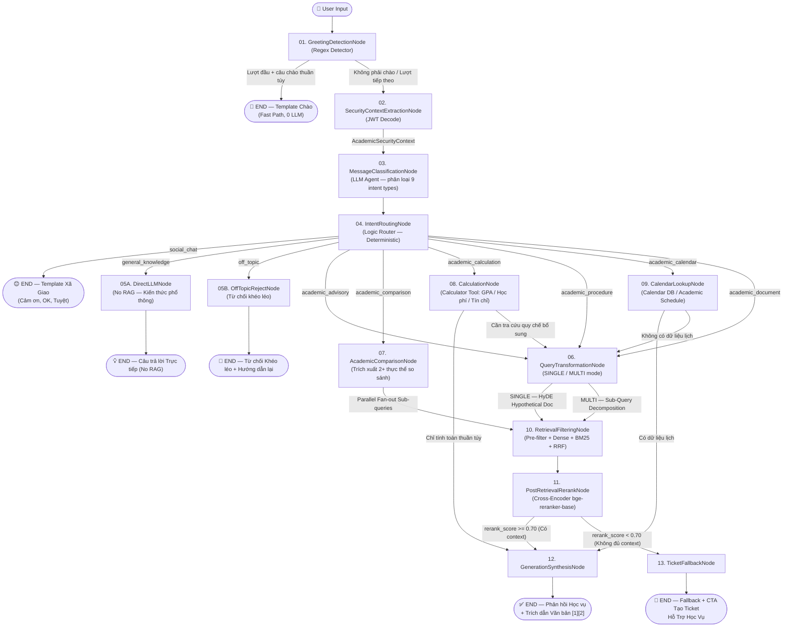

# KLTN Academic Chatbot — Graph Kiến Trúc Toàn Diện
# Hệ Thống Chatbot Trích Xuất Tài Liệu Học Vụ Đại Học / Cao Đẳng (Phân Cấp & Phân Quyền)

---

## 1. Tổng Quan Kiến Trúc & Triết Lý Thiết Kế

Hệ thống Graph được xây dựng theo nguyên tắc **"Chi phí thấp nhất có thể — Chất lượng cao nhất cần thiết"**:

| Tier | Loại câu hỏi | Cơ chế xử lý | Chi phí |
| :--- | :--- | :--- | :--- |
| **Tier 0 — Fast Path** | Chào hỏi, xã giao, khen ngợi | Regex / Template tĩnh, không gọi LLM | 🟢 Gần 0 |
| **Tier 1 — Direct LLM** | Kiến thức phổ thông đơn giản (1+1, thủ đô VN) | LLM trả lời trực tiếp, không RAG | 🟡 Thấp |
| **Tier 2 — Calculation** | Tính GPA, học phí, số tín chỉ tích lũy | Calculator Tool + LLM (không cần VectorDB) | 🟡 Thấp |
| **Tier 3 — Calendar Lookup** | Lịch học, lịch thi, thời hạn đăng ký môn | Calendar DB Lookup + LLM | 🟡 Thấp |
| **Tier 4 — Single RAG** | Hỏi 1 quy chế, 1 thủ tục cụ thể | HyDE + Dense/Sparse Retrieval + Rerank | 🔶 Trung bình |
| **Tier 5 — Parallel RAG** | So sánh 2 ngành, câu hỏi đa chiều phức tạp | Multi-Query Fan-out + Fusion + Rerank + Synthesis | 🔴 Cao |
| **Tier 6 — Ticket Fallback** | Không tìm thấy tri thức vượt ngưỡng | Fallback + CTA Ticket Hỗ Trợ | 🟢 Gần 0 |

---

## 2. Danh Sách Đầy Đủ Các Nodes & Tính Chất

| # | Node | Tính Chất | Có dùng LLM? | Có dùng RAG? |
| :--- | :--- | :--- | :--- | :--- |
| 01 | `GreetingDetectionNode` | Deterministic (Regex) | ❌ | ❌ |
| 02 | `SecurityContextExtractionNode` | Deterministic (JWT Decode) | ❌ | ❌ |
| 03 | `MessageClassificationNode` | LLM Agent | ✅ | ❌ |
| 04 | `IntentRoutingNode` | Deterministic (Logic Router) | ❌ | ❌ |
| 05A | `DirectLLMNode` | LLM trực tiếp | ✅ | ❌ |
| 05B | `OffTopicRejectNode` | Deterministic + Template | ❌ | ❌ |
| 06 | `QueryTransformationNode` | LLM Agent (HyDE / Multi-query) | ✅ | ❌ |
| 07 | `AcademicComparisonNode` | LLM Agent | ✅ | ❌ |
| 08 | `CalculationNode` | Calculator Tool + LLM | ✅ Tool | ❌ |
| 09 | `CalendarLookupNode` | Calendar DB + LLM | ✅ | ❌ |
| 10 | `RetrievalFilteringNode` | VectorDB (Pre-filter + Hybrid + RRF) | ❌ | ✅ |
| 11 | `PostRetrievalRerankNode` | Cross-Encoder + Score Threshold | ❌ | ✅ |
| 12 | `GenerationSynthesisNode` | LLM Agent (Fan-in) | ✅ | ✅ |
| 13 | `TicketFallbackNode` | Deterministic + Template | ❌ | ❌ |

---

## 3. Sơ Đồ Chuyển Trạng Thái Đầy Đủ (Mermaid)



---

## 4. Chi Tiết Phân Tích Từng Node

### 4.1 `GreetingDetectionNode` — Tier 0, Deterministic
**Vai trò**: Phát hiện câu chào hỏi xã giao thuần túy ở lượt đầu tiên, trả template ngay mà không tiêu tốn token LLM.

**Logic**:
- Dùng Regex Pattern Matching + Từ điển từ khóa chào hỏi (`chào`, `xin chào`, `hello`, `hi`, `hey`).
- CHỈ kích hoạt Fast Path khi `len(conversation_history) == 0` (lượt đầu tiên) VÀ tin nhắn khớp pattern.
- Lượt tiếp theo dù có chào hỏi vẫn đi vào luồng chính để tránh bỏ qua nội dung câu hỏi thật.

**Điều kiện Fast Path → Template Chào**:
- "Chào", "xin chào", "hello", "hi", "alo"
- "bot ơi", "trợ lý ơi", "cho mình hỏi" (với lượt đầu tiên)

---

### 4.2 `SecurityContextExtractionNode` — Tier 0, Deterministic
**Vai trò**: Giải mã JWT Token để lấy bối cảnh phân quyền tài khoản học vụ.

**Output State**:
```python
class AcademicSecurityContext(BaseModel):
    user_id: str
    role: Literal["SINH_VIEN", "GIANG_VIEN", "CAN_BO_PHONG_BAN", "ADMIN"]
    organization_scopes: List[str]   # ["KHOA_CNTT", "GLOBAL"]
    max_access_level: int            # 1–5
    student_program: str | None      # Chương trình học (nếu là SINH_VIEN)
    faculty_code: str | None         # Mã khoa (nếu là GIANG_VIEN)
```

---

### 4.3 `MessageClassificationNode` — LLM Agent (Bất đồng bộ)
**Vai trò**: Phân loại ý định của tin nhắn vào **9 loại intent** để quyết định luồng tối ưu.

**9 Intent Types**:
| Intent | Mô tả | Ví dụ |
| :--- | :--- | :--- |
| `greeting` | Chào hỏi thuần túy (lượt đầu xử lý trước ở node 01) | "Chào bot!" |
| `social_chat` | Xã giao không phải chào: cảm ơn, ok, hay đấy | "Cảm ơn bạn", "Ok, hiểu rồi" |
| `general_knowledge` | Kiến thức phổ thông, không cần tra quy chế | "1+1 bằng mấy?", "Thủ đô Việt Nam là gì?" |
| `academic_advisory` | Hỏi quy chế, điều kiện, chính sách học vụ | "Điều kiện học bổng loại giỏi là gì?" |
| `academic_comparison` | So sánh 2+ ngành/chương trình/khoa/học phí | "Ngành CNTT và Kế toán học phí khác nhau thế nào?" |
| `academic_calculation` | Yêu cầu tính toán số: GPA, tín chỉ, học phí | "Em tính GPA học kỳ này được không?" |
| `academic_procedure` | Hỏi quy trình thủ tục, các bước thực hiện | "Làm sao để xin giấy xác nhận sinh viên?" |
| `academic_calendar` | Hỏi ngày tháng: lịch thi, hạn đăng ký môn | "Khi nào hết hạn đăng ký môn học kỳ 2?" |
| `academic_document` | Xin hướng dẫn cấp giấy tờ chính thức | "Thủ tục xin bảng điểm chính thức như thế nào?" |
| `off_topic` | Hoàn toàn ngoài phạm vi học vụ | "Cho mình công thức nấu phở", "Giá vàng hôm nay" |

**Prompt**: `agents/message_classification.yaml`

---

### 4.4 `IntentRoutingNode` — Deterministic (Logic Router)
**Vai trò**: Đọc kết quả `intent_type` từ State và điều hướng sang Node xử lý phù hợp. Node này không gọi LLM.

**Routing Table**:
```python
ROUTING_MAP = {
    "social_chat":           -> EndSocialTemplate,
    "general_knowledge":     -> DirectLLMNode,
    "off_topic":             -> OffTopicRejectNode,
    "academic_advisory":     -> QueryTransformationNode(mode="SINGLE" or "MULTI"),
    "academic_comparison":   -> AcademicComparisonNode,
    "academic_calculation":  -> CalculationNode,
    "academic_procedure":    -> QueryTransformationNode(mode="PROCEDURE"),
    "academic_calendar":     -> CalendarLookupNode,
    "academic_document":     -> QueryTransformationNode(mode="DOCUMENT"),
}
```

---

### 4.5A `DirectLLMNode` — Tier 1, LLM trực tiếp (No RAG)
**Vai trò**: Xử lý các câu hỏi kiến thức phổ thông đơn giản không cần tra cứu tài liệu quy chế.

**Điều kiện kích hoạt**: `intent_type = "general_knowledge"` với `confidence >= 0.90`.

**Ví dụ câu hỏi**:
- "1 + 1 bằng mấy?" → Trả về "2" không cần RAG.
- "Python là gì?" → Trả lời trực tiếp.
- "Tiếng Anh của 'sinh viên' là gì?" → Trả lời trực tiếp.

**Prompt**: `main/chat_direct_llm.yaml` (không có `{prepared_context}`)

---

### 4.5B `OffTopicRejectNode` — Tier 0, Deterministic + Template
**Vai trò**: Từ chối khéo léo các câu hỏi hoàn toàn ngoài phạm vi học vụ, đồng thời giới thiệu lại phạm vi hệ thống có thể hỗ trợ.

**Nguyên tắc**:
- Không dùng LLM (trả template tĩnh đã soạn sẵn).
- Lịch sự, không phán xét người dùng.
- Liệt kê 3-5 ví dụ việc hệ thống CÓ THỂ giúp.

**Template mẫu**:
```
Xin lỗi, mình chỉ có thể hỗ trợ các câu hỏi liên quan đến học vụ của Nhà trường.
Ví dụ mình có thể giúp bạn:
• Tra cứu điều kiện học bổng, cảnh báo học vụ
• Giải thích quy chế thi cử, đăng ký môn học
• Tính toán GPA, học phí theo ngành
• Hướng dẫn thủ tục xin giấy tờ học vụ
```

---

### 4.6 `QueryTransformationNode` — LLM Agent, 3 modes
**Vai trò**: Biến đổi câu hỏi thô thành dạng phù hợp để tìm kiếm trong VectorDB.

**Mode SINGLE (HyDE)**: Sinh văn bản trả lời giả định mang văn phong hành chính.
**Mode MULTI**: Phân rã thành 2-3 Sub-queries độc lập.
**Mode PROCEDURE**: Sinh query dạng "Quy trình / Các bước để [hành động]" để ưu tiên kết quả có cấu trúc tuần tự.
**Mode DOCUMENT**: Sinh query dạng "Điều kiện / Hướng dẫn xin cấp [tên giấy tờ] tại [đơn vị]".

---

### 4.7 `AcademicComparisonNode` — LLM Agent + Parallel Fan-out
**Vai trò**: Trích xuất các thực thể cần so sánh (2+ ngành/khoa/chương trình), phân rã thành Sub-queries độc lập cho từng thực thể.

**Ví dụ**:
- Input: *"Ngành CNTT và ngành Kế toán học phí mỗi kỳ chênh nhau bao nhiêu?"*
- Entities: `["Công nghệ thông tin", "Kế toán"]`
- Sub-queries:
  1. `"Định mức học phí ngành Công nghệ thông tin theo học kỳ 2024-2025"`
  2. `"Định mức học phí ngành Kế toán theo học kỳ 2024-2025"`
- Kết quả được Parallel Fan-out vào `RetrievalFilteringNode`, tổng hợp tại `GenerationSynthesisNode` dưới dạng bảng so sánh.

---

### 4.8 `CalculationNode` — Calculator Tool + LLM
**Vai trò**: Thực hiện tính toán học vụ dựa trên dữ liệu người dùng cung cấp.

**3 loại tính toán được hỗ trợ**:

| Loại | Formula | Ví dụ |
| :--- | :--- | :--- |
| **GPA Calculator** | `GPA = Σ(điểm_i × tín_chỉ_i) / Σ(tín_chỉ_i)` | "Em học 4 môn: Toán 3TC 8đ, Lý 2TC 6đ..." |
| **Credit Accumulator** | Cộng tín chỉ đã qua, so sánh với yêu cầu | "Em còn thiếu bao nhiêu tín chỉ để tốt nghiệp?" |
| **Tuition Calculator** | `Học phí = số_TC × đơn_giá_TC_ngành` | "Học kỳ này đăng ký 18 tín chỉ ngành CNTT tốn bao nhiêu?" |

**Logic**: LLM trích xuất tham số → Python Calculator Tool tính toán → LLM diễn giải kết quả bằng ngôn ngữ tự nhiên.

**Fallback**: Nếu người dùng không cung cấp đủ tham số, hệ thống hỏi lại thay vì tự suy đoán.

---

### 4.9 `CalendarLookupNode` — Calendar DB + LLM
**Vai trò**: Tra cứu dữ liệu lịch học vụ chính thức từ Calendar Database (không phải VectorDB).

**Loại dữ liệu lịch**:
- Ngày bắt đầu / kết thúc đăng ký môn học.
- Lịch thi (thi giữa kỳ, cuối kỳ).
- Thời hạn nộp học phí.
- Lịch xét học bổng, cảnh báo học vụ.
- Ngày nghỉ lễ, tuần sinh hoạt công dân.

**Fallback**: Nếu Calendar DB không có dữ liệu → chuyển sang `QueryTransformationNode` để thử tìm trong VectorDB lịch được scan vào.

---

### 4.10 `RetrievalFilteringNode` — VectorDB (3 tầng)
**Tầng 1 — Hard Pre-filter**: Lọc theo `organization_scopes` + `max_access_level` (Qdrant Payload Filter).

**Tầng 2 — Parallel Hybrid Search**: `asyncio.gather` chạy đồng thời:
- Dense Retrieval (Cosine Similarity Vector)
- Sparse Retrieval (BM25 Keyword exact match)

**Tầng 3 — RRF Fusion**: Hợp nhất tất cả kết quả → Top 15-20 raw chunks.

---

### 4.11 `PostRetrievalRerankNode` — Cross-Encoder
**Model**: `bge-reranker-base` (mã nguồn mở, self-hosted)

**Bước 1**: Rerank 20 chunks bằng Cross-Encoder (câu hỏi gốc ↔ từng chunk).
**Bước 2**: Lọc ngưỡng `rerank_score >= 0.70`.
**Bước 3**: Nén bỏ văn bản dư thừa trong chunk.
**Output**: Top 3-5 chunks hoặc `has_valid_context = False`.

---

### 4.12 `GenerationSynthesisNode` — Fan-in LLM Agent
**Vai trò**: Gom toàn bộ ngữ cảnh từ các nhánh song song, sinh câu trả lời mạch lạc kèm trích dẫn.

**Lắp ghép prompt động dựa theo luồng**:
| Luồng đến | Template chính | Có bảng so sánh? |
| :--- | :--- | :--- |
| Single Advisory | `chat_single_intent.yaml` | ❌ |
| Multi-Intent / Comparison | `chat_multi_intent_synthesis.yaml` | ✅ |
| Calculation | `chat_calculation_result.yaml` | ❌ (Hiện công thức) |
| Calendar | `chat_calendar_result.yaml` | ❌ |
| Procedure | `chat_procedure_steps.yaml` | ❌ (Danh sách bước) |
| Document | `chat_document_guide.yaml` | ❌ |

**Citation Protocol**: Mọi khẳng định gắn `[1]`, `[2]` và liệt kê nguồn ở cuối.

---

### 4.13 `TicketFallbackNode` — Zero-Hallucination Fallback
**Vai trò**: Phản hồi an toàn khi RAG không tìm đủ ngữ cảnh.

**Nguyên tắc tuyệt đối**: Không để LLM tự đoán quy chế khi không có nguồn tri thức xác nhận.

**Action Payload trả về**:
```json
{
  "message": "Hệ thống chưa tìm thấy quy định chính thức cho câu hỏi này.",
  "ui_buttons": [{
    "label": "Tạo Ticket Hỗ Trợ Học Vụ",
    "action": "OPEN_TICKET_MODAL",
    "prefill": {
      "subject": "<câu hỏi rút gọn>",
      "department": "PHONG_DAOTAO | PHONG_CTSV"
    }
  }]
}
```

---

## 5. So Sánh Chi Tiết LISA vs. KLTN Academic Graph

| Điểm so sánh | LISA AI Agent Graph | KLTN Academic RAG Graph |
| :--- | :--- | :--- |
| **Số Node** | 9 Nodes | 13 Nodes |
| **Tier Fast Path** | GreetingDetectionNode (Regex) | GreetingDetectionNode + OffTopicRejectNode + SocialChatTemplate |
| **Tier kiến thức phổ thông** | Không có | DirectLLMNode (1+1, kiến thức đơn giản) |
| **Phân quyền** | Không có | SecurityContextExtractionNode (JWT → Role + Scopes + Level) |
| **Phân loại Intent** | 3 types (comparison, currency, unknown) | 9 types với routing phức tạp |
| **Nhánh Tính toán** | CurrencyConversionNode (tool tỉ giá) | CalculationNode (GPA + Học phí + Tín chỉ) |
| **Nhánh Lịch học** | Không có | CalendarLookupNode (Calendar DB) |
| **Biến đổi truy vấn** | Không có (query thô) | HyDE / Multi-query / Procedure mode / Document mode |
| **Tìm kiếm** | Keyword / Direct Doc | Pre-filtered Hybrid (Dense + BM25) + RRF |
| **Tinh lọc** | Không có Re-rank | Cross-Encoder Rerank + Score Threshold |
| **Gộp kết quả** | Tuần tự, đơn luồng | Fan-in Aggregation (song song) |
| **Trích dẫn nguồn** | Không có Citation | Citation Engine [1][2] + Link văn bản gốc |
| **Fallback** | Hỏi tiếp metadata | Ticket Fallback + CTA tạo phiếu hỗ trợ |
| **Chống hallucination** | Partial (qua prompt) | Cứng (TicketFallbackNode khi score < 0.70) |
