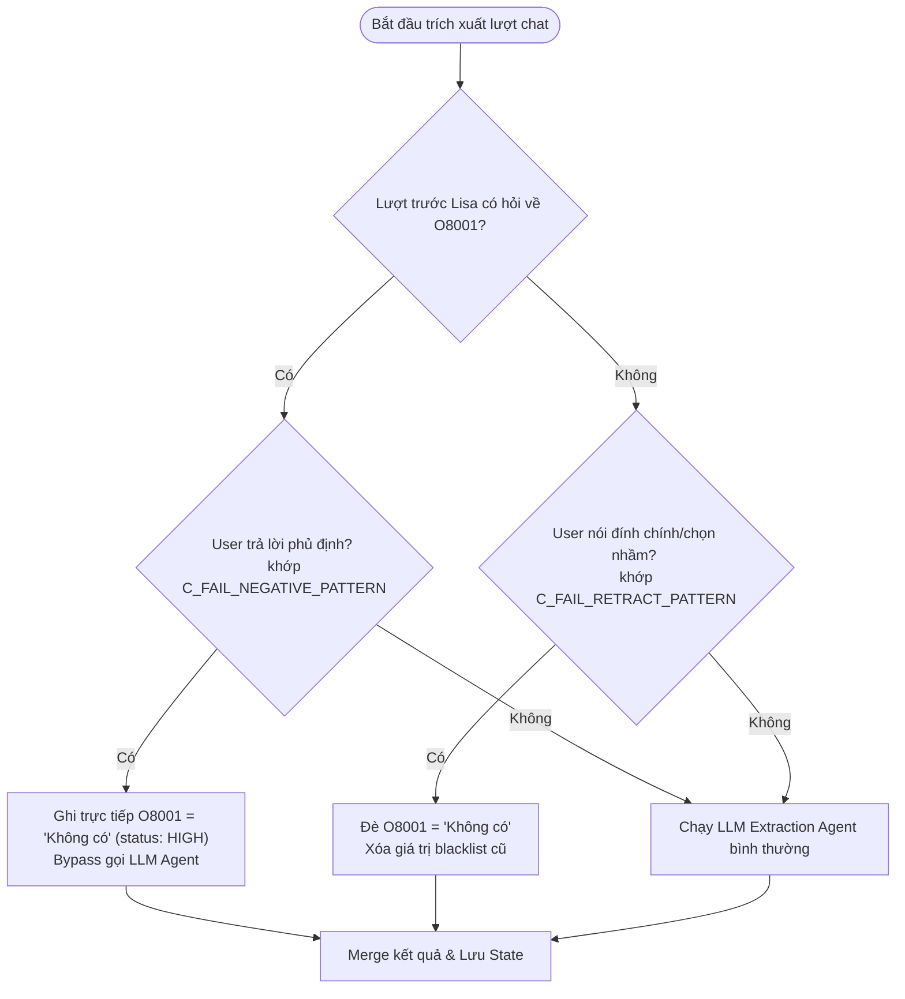

# Cơ Chế Hoạt Động Của Blacklist & Warning (LISA AI Agent)

Tài liệu này phân tích sâu và toàn diện cách hoạt động của hai trường thông tin rủi ro lớn trong hệ thống LISA AI Agent: **Blacklist (O8001)** và **Warning (O8002)**. Phân tích này bao gồm cách định nghĩa dữ liệu, cơ chế trích xuất & bypass, luồng rẽ nhánh trong chat graph và cách lắp ghép prompt phản hồi.

---

## 1. Tổng Quan Cấu Trúc Dữ Liệu

Blacklist và Warning được định nghĩa như các trường metadata tùy chọn (Optional Fields - ký hiệu đầu bằng `O`) trong file cơ sở dữ liệu `storage/private/METADATA.csv`:

| Mã trường | Tên hiển thị | Ý nghĩa nghiệp vụ | Tính chất trong Graph |
| :--- | :--- | :--- | :--- |
| **`O8001`** | **Blacklist** | Các trường hợp vi phạm luật di trú nghiêm trọng hoặc bị cấm nhập cảnh trực tiếp. | **Chặn luồng xử lý (Early Reject / Short-circuit)** |
| **`O8002`** | **Warning** | Các yếu tố rủi ro cao hoặc bất lợi trong hồ sơ (cần giải trình thêm). | **Không chặn luồng, nạp tài liệu hướng dẫn xử lý** |

### Allowed Values của từng trường (Quy định trong Registry):
* **`O8001` (Blacklist)**:
  * `Đang bị cấm nhập cảnh quốc gia đến`
  * `Xin lại visa cùng mục đích ngay sau khi rớt (Đang bị giới hạn thời gian xin lại)`
  * `Hồ sơ sai lệch, gian dối và bị lãnh sự phát hiện (Bị cấm xin visa)`
  * `Không có` (Giá trị sentinel `C_FAIL_NONE_VALUE` thể hiện khách hàng an toàn)
* **`O8002` (Warning)**:
  * `Không chứng minh được mục đích chuyến đi rõ ràng...`
  * `Hộ khẩu thuộc các tỉnh blacklist của Đại sứ quán...`
  * `Có lịch sử rớt visa nước dự định đến`
  * `Từng sử dụng visa sai mục đích`
  * `Đã từng cư trú bất hợp pháp và đã quá hạn cấm`
  * `Có người thân đang cư trú bất hợp pháp tại quốc gia đến`
  * `Có tiền án tiền sự`
  * `Đã từng bị kết án tù từ 1 năm trở lên ở bất kỳ quốc gia nào`
  * `Không có` (Không gặp rủi ro nào)

---

## 2. Cơ Chế Trích Xuất & Tối Ưu Hóa (Bypass & Post-process)

Hệ thống không chỉ dựa hoàn toàn vào mô hình LLM để trích xuất hai trường nhạy cảm này mà kết hợp các quy tắc định nghĩa cứng (Deterministic Rules) bằng biểu thức chính quy (Regex) trong `app/domains/chat/graph/nodes/metadata_extraction.py`:



### 2.1. Bộ lọc phủ định nhanh (`C_FAIL_NEGATIVE_PATTERN`)
Khi chatbot hỏi khách hàng về các điều kiện blacklist (ví dụ: hiển thị menu lựa chọn nhanh kèm câu hỏi: *"Anh/chị có thuộc trường hợp nào ở trên không?"*), khách hàng thường phản hồi ngắn gọn dạng *"không có"*, *"không bị"*, *"mình không"*.
* **Logic**: Nếu tin nhắn của người dùng khớp với biểu thức chính quy `C_FAIL_NEGATIVE_PATTERN` (chứa các cụm từ phủ định tiếng Việt phong phú như *"hoàn toàn không"*, *"chưa từng"*, *"chả bị"*, *"không thuộc diện nào cả"*...) và trợ lý ảo thực sự đang hỏi về Blacklist, hệ thống sẽ **bỏ qua LLM extraction** và ghi trực tiếp `O8001 = "Không có"` với độ tin cậy `HIGH`.
* **Mục tiêu**: Tiết kiệm chi phí gọi LLM, tăng tốc độ phản hồi (latency) về dưới 50ms, và triệt tiêu lỗi nhận diện nhầm (false-positives) của AI đối với các câu phủ định ngắn.

### 2.2. Bộ lọc đính chính/rút lại lựa chọn (`C_FAIL_RETRACT_PATTERN`)
Nếu khách hàng bấm nhầm vào một nút blacklist trên giao diện hoặc chat đùa giỡn dẫn đến hệ thống ghi nhận họ bị blacklist, họ cần cơ chế rút lại.
* **Logic**: Khi hệ thống phát hiện tin nhắn người dùng khớp với `C_FAIL_RETRACT_PATTERN` (chứa các từ khóa như *"chọn nhầm rồi"*, *"bấm lộn"*, *"đính chính lại"*...) và trong metadata của họ **đang lưu một giá trị blacklist thực tế**, hệ thống sẽ ghi đè giá trị đó thành `"Không có"`.
* **Mục tiêu**: Giúp trải nghiệm khách hàng mượt mà, cho phép họ tự sửa đổi thông tin khai báo sai mà không cần phải tải lại hoặc tạo phiên chat mới.

---

## 3. Luồng Định Tuyến Trọng Yếu Trong Graph

Sự khác biệt lớn nhất giữa Blacklist và Warning nằm ở cách Chat Graph định tuyến hành vi tư vấn:

### 3.1. Đối với Blacklist (`O8001`): Chặn Luồng Sớm (Early Reject)
Tại node `EarlyRejectNode` (`app/domains/chat/graph/nodes/early_reject.py`):
1. Hệ thống tìm kiếm tất cả các cặp completed pairs trong ma trận quyết định `deterministic_layer.csv` có độ ưu tiên là `c_fail` kết nối với `O8001`.
2. Kiểm tra xem giá trị của `O8001` đã được thu thập hay chưa.
3. Nếu giá trị đã thu thập **khác** `"Không có"` (nghĩa là khách hàng thực sự rơi vào một trong các điều kiện cấm nhập cảnh):
   - Node sẽ phát tín hiệu ngắt graph ngay lập tức (short-circuit).
   - Trả về `LLMStreamResult` có cấu hình `c_fail_category = "blacklist"` và `c_fail_pair_id` tương ứng.
   - **Hệ quả**: Bỏ qua hoàn toàn các bước kiểm tra metadata bắt buộc (`MandatoryValidationNode`) hay đề xuất câu hỏi (`SuggestionNode`), đi thẳng đến bước phản hồi lỗi cấm nhập cảnh.

### 3.2. Đối với Warning (`O8002`): Nạp Ngữ Cảnh Xử Lý Rủi Ro
`Warning` không kích hoạt từ chối sớm. Lượt chạy graph vẫn tiếp tục bình thường:
1. Vượt qua `EarlyRejectNode` sang `MandatoryValidationNode` và `SuggestionNode`.
2. Tại `SuggestionNode`, `SuggestionService` dùng `MatrixLoader` quét các completed pairs chứa `O8002` (ví dụ: `M0001_O8002` - sự kết hợp giữa Quốc gia đến và các điểm rủi ro hồ sơ).
3. Hệ thống kiểm tra sự tồn tại của tài liệu nghiệp vụ tương ứng trong ổ đĩa (ví dụ: `storage/private/market_data/HK/M0001_O8002/M0001_O8002.md`).
4. Tải nội dung tài liệu này và đưa vào danh sách `confirmation_docs` của prompt phản hồi.
5. **Hệ quả**: LLM nhận được hướng dẫn xử lý rủi ro cụ thể của quốc gia đến để tư vấn cho khách hàng cách khắc phục.

---

## 4. Cơ Chế Lắp Ghép Prompt Phản Hồi Cho LLM

Khi LLM sinh phản hồi thông qua `response_agent`, sự có mặt của Blacklist hay Warning sẽ làm thay đổi cấu trúc System Prompt:

### 4.1. Lắp ghép khi bị dính Blacklist (`c_fail`)
Hệ thống sử dụng template `chat_cfail.yaml` để sinh prompt, chèn nội dung chỉ dẫn `answer_cfail.yaml`:
* **Nội dung chỉ thị bắt buộc**:
  - Không được từ chối cộc lốc hoặc dùng các câu kết luận trực diện gây hoang mang cho người dùng (ví dụ: *"Bạn bị cấm rồi, không làm được"*).
  - Phải giải thích rõ việc bị cấm nhập cảnh sẽ ảnh hưởng thế nào đến quá trình xin visa (ví dụ: hồ sơ bị kiểm soát chặt hơn, phụ thuộc vào lý do và thời gian cấm).
  - Phải đề xuất hướng xử lý hoặc cung cấp thông tin tham khảo hữu ích (cách kiểm tra thời hạn cấm, nộp đơn xin cứu xét nếu có).
  - Kết thúc phản hồi bằng cách hướng dẫn người dùng tham khảo ý kiến của cơ quan thẩm quyền hoặc luật sư di trú.
  - **Cấm hỏi thêm bất kỳ thông tin nào khác** để chấm dứt chuỗi hội thoại thu thập.

### 4.2. Lắp ghép khi dính Warning
Hệ thống sử dụng template `chat_default.yaml` hoặc `chat_condition.yaml` như bình thường, nhưng chèn thêm các tài liệu hướng dẫn xử lý rủi ro (`O8002`) vào phần `task_1`:
* **Cấu trúc XML của Prompt**:
  ```xml
  <knowledge_for_Quốc_gia_đến_and_Warning>
  [Tài liệu: Quốc gia đến → Warning]
  - Trường hợp khách hàng có lịch sử rớt visa: Yêu cầu chuẩn bị thư giải trình (Letter of Explanation) nêu rõ lý do rớt lần trước và các thay đổi tích cực trong hồ sơ hiện tại...
  - Trường hợp hộ khẩu thuộc tỉnh hạn chế: Cần bổ sung bằng chứng công việc cực kỳ mạnh mẽ (hợp đồng dài hạn, đóng bảo hiểm đầy đủ) và tài chính minh bạch...
  </knowledge_for_Quốc_gia_đến_and_Warning>
  ```
* **Hành vi LLM**: LLM thực hiện nhiệm vụ xác nhận thông tin, đọc tài liệu này để cảnh báo khách hàng về điểm yếu trong hồ sơ một cách khôn khéo và tư vấn cho họ danh sách các giấy tờ bổ sung cần thiết để thuyết phục Lãnh sự quán.

---

## 5. Bảng So Sánh Tóm Tắt Blacklist vs Warning

| Tiêu chí | Blacklist (`O8001`) | Warning (`O8002`) |
| :--- | :--- | :--- |
| **Mục đích** | Phát hiện các yếu tố cấm nhập cảnh tuyệt đối. | Phát hiện rủi ro và các điểm yếu trong hồ sơ. |
| **Quyết định trong Graph** | Chặn luồng ngay lập tức tại `EarlyRejectNode`. | Tiếp tục đi hết Graph để thu thập thông tin khác. |
| **Cơ chế xử lý nhanh** | Có bộ lọc phủ định (`C_FAIL_NEGATIVE_PATTERN`) và đính chính (`C_FAIL_RETRACT_PATTERN`). | Trích xuất thông qua LLM Agent thông thường. |
| **Ngữ cảnh Prompt** | Nạp mẫu `answer_cfail.yaml` (Yêu cầu giải thích, hướng dẫn, khuyên tìm luật sư, cấm đặt câu hỏi tiếp). | Nạp các tài liệu nghiệp vụ hướng dẫn khắc phục rủi ro vào thẻ `<knowledge_for_...>` của `Task 1`. |
| **Trải nghiệm người dùng** | Được tư vấn hướng xử lý đặc biệt và dừng cuộc trò chuyện. | Được cảnh báo điểm yếu hồ sơ và tiếp tục trả lời các câu hỏi thu thập thông tin tiếp theo. |
