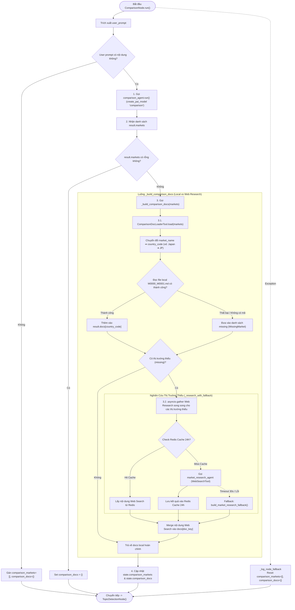

# Phân Tích Chi Tiết ComparisonNode (LISA AI Agent)

Tài liệu này phân tích chuyên sâu về kiến trúc, luồng nạp tài liệu hybrid (Local Docs vs External Web Research) và cơ chế hoạt động của **`ComparisonNode`** trong hệ thống LISA AI Agent. Node này chịu trách nhiệm chuẩn bị đầy đủ dữ liệu so sánh thị trường visa (tài liệu tổng quan `M0000_M0001` của các quốc gia) trước khi chuyển giao luồng sang `TopicDetectionNode`.

---

## 1. Tổng Quan Kiến Trúc & Vai Trò Node

`ComparisonNode` kế thừa từ `BaseNode[ChatState, ChatDeps, ChatResult]` của `pydantic_graph`.
Mục tiêu cốt lõi của node bao gồm:

1. **Phát Hiện Danh Sách Thị Trường (`comparison_agent`)**: Gọi PAI agent để trích xuất danh sách các quốc gia/thị trường mà khách hàng muốn so sánh (dạng English short-form name như `Japan`, `Korea`, `USA`, `Australia`...).
2. **Nạp Tài Liệu So Sánh Đa Nguồn (`_build_comparison_docs`)**:
   - **Nguồn 1 (Local Storage)**: Nạp các tài liệu nghiệp vụ cục bộ `M0000_M0001.md` từ ổ đĩa local qua `ComparisonDocLoaderTool`.
   - **Nguồn 2 (External Market Research)**: Nếu thị trường thiếu tài liệu local (quốc gia mới/chưa có trong storage), hệ thống tự động kích hoạt `market_research_agent` sử dụng **Web Search Tool** để tìm kiếm và tổng hợp tài liệu visa trực tuyến.
3. **Cơ Chế Caching Redis 24h**: Kết quả Web Search của `market_research_agent` được cache lại Redis trong **24 giờ** (`MARKET_RESEARCH_CACHE_TTL_SECONDS = 86400`) để tránh gọi Web Search trùng lặp cho cùng một quốc gia.
4. **Bảo Vệ Thời Gian Chờ (Timeout Wall-clock & Fallback Static)**: Đặt giới hạn timeout 30 giây (`MARKET_RESEARCH_TIMEOUT_SECONDS = 30.0`) cho mỗi tác vụ research. Nếu Web Search bị lỗi hoặc timeout, hệ thống tự động sinh ra nội dung tư vấn tĩnh fallback (`build_market_research_fallback`).
5. **Cập Nhật State & Chuyển Tải Luồng**: Cập nhật `comparison_markets` và `comparison_docs` lên `ChatState`, sau đó chuyển giao điều khiển sang `TopicDetectionNode()`.

---

## 2. Dynamic State Ownership (Các Trường State Độc Quyền)

`ComparisonNode` trực tiếp quản lý và cập nhật 2 trường dữ liệu chính trên `ChatState`:

| Trường State | Kiểu Dữ Liệu | Mô Tả Chức Năng |
| :--- | :--- | :--- |
| `comparison_markets` | `list[str]` | Danh sách tên tiếng Anh ngắn gọn của các quốc gia/thị trường cần so sánh (vd: `["Japan", "Korea"]`). |
| `comparison_docs` | `dict[str, str]` | Map từ mã quốc gia (`doc_key` như `"JP"`, `"KR"`) ➔ Nội dung tài liệu tổng quan visa (`M0000_M0001` hoặc nội dung Web Research). |

---

## 3. Sơ Đồ Luồng Hoạt Động Chi Tiết (Sequence & Activity Flow)

---

## 4. Chi Tiết Các Khối Xử Lý Trong Mã Nguồn

### 4.1. `comparison_agent` (Phát Hiện Thị Trường)
* **Agent Definition** ([`app/domains/chat/graph/agents/comparison.py`](file:///Users/admin/Desktop/Hoang_Huy/lisa-ai-agent/app/domains/chat/graph/agents/comparison.py)):
  * Trích xuất danh sách các tên thị trường dưới dạng `ComparisonResult(markets=list[str])`.
  * System prompt được nạp từ `comparison.yaml`.

### 4.2. `ComparisonDocLoaderTool` (Nạp File Local)
* **Cách đọc file**:
  * Chuyển đổi tên quốc gia sang mã thị trường qua `get_country_code_by_name(market_name)` (ví dụ `Japan` ➔ `JP`).
  * Sử dụng `DocumentLoader(MARKET_DATA_BASE_PATH / country_code)` để đọc file `M0000_M0001/M0000_M0001.md`.
  * Đọc song song qua `asyncio.to_thread`.
  * Nếu file tồn tại ➔ Lưu vào `docs[country_code]`.
  * Nếu file không tồn tại hoặc lỗi đọc ➔ Thêm vào danh sách `missing: list[MissingMarket]`.

### 4.3. `market_research_agent` & Redis Cache 24h (Web Search Fallback)
* Khi có thị trường trong danh sách `missing`:
  * Hệ thống khởi chạy `asyncio.gather` thực thi `_research_with_fallback` cho từng quốc gia thiếu.
  * **Redis Cache Check**: Hàm `research_market` kiểm tra namespace `market_research` trên Redis với TTL **86,400 giây (24 giờ)**. Nếu đã từng search thị trường này trong vòng 24h ➔ Trả về kết quả từ Cache ngay lập tức.
  * **Web Search Tool**: Nếu cache miss, gọi `market_research_agent` có gắn `NativeTool(WebSearchTool())` để tìm kiếm thông tin điều kiện visa mới nhất từ internet.
  * **Timeout & Static Fallback Guard**: Bọc trong `asyncio.wait_for(..., timeout=30.0)`. Nếu quá 30 giây hoặc gặp lỗi mạng ➔ Trả về văn bản tĩnh fallback `build_market_research_fallback(market_name)`.

---

## 5. Chiến Lược Quản Lý Lỗi (Fallback Strategy Matrix)

| Kịch Bản Lỗi | Cơ Chế Phản Ứng (Fallback) | Kết Quả Đạt Được |
| :--- | :--- | :--- |
| User prompt rỗng | Set `comparison_markets = []`, `comparison_docs = {}` | Chuyển tiếp ngay sang `TopicDetectionNode()`. |
| `comparison_agent` không trả về thị trường nào | Set `comparison_docs = {}` | Chuyển tiếp an toàn sang `TopicDetectionNode()`. |
| Thiếu file tài liệu local `M0000_M0001.md` | Đưa vào danh sách `missing` ➔ Chuyển sang Web Search Agent | Tự động bổ sung tài liệu từ internet. |
| Web Search Agent bị timeout (> 30s) hoặc lỗi | Bắt lỗi trong `_research_with_fallback`, trả về `build_market_research_fallback` | Hệ thống vẫn có nội dung hướng dẫn cơ bản cho khách, không bị treo request. |
| Unhandled Exception tại Node root | Bắt lỗi bởi `except Exception as e`, log qua `_log_node_fallback`, reset state | Giữ cho graph luôn chạy tiếp tục sang `TopicDetectionNode()`. |

---

## 6. Tổng Kết Ưu Điểm Kiến Trúc (Key Architectural Highlights)

1. **Nạp Dữ Liệu Lai (Hybrid Doc Loading)**: Kết hợp giữa tài liệu cục bộ chuẩn hóa (`DocumentLoader`) và khả năng truy vấn web thực tế (`WebSearchTool`), giúp hệ thống hỗ trợ so sánh cho **bất kỳ quốc gia nào trên thế giới**.
2. **Cơ Chế Caching Thông Minh**: Cache kết quả Web Search 24 giờ giúp tiết kiệm chi phí API search và giảm latency cho các câu hỏi trùng lặp về cùng một quốc gia.
3. **An Toàn Tuyệt Đối (Wall-clock Timeout)**: Rào chắn Timeout 30s đảm bảo một truy vấn web chậm không làm nghẽn toàn bộ Pipeline hội thoại.
