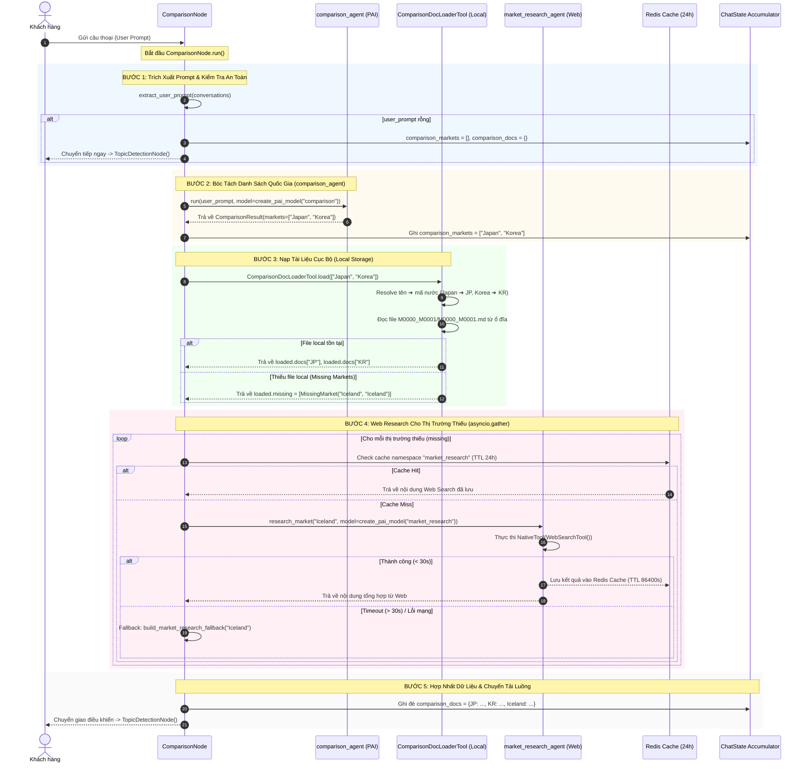

# Chi Tiết Luồng Xử Lý Của ComparisonNode (LISA AI Agent)

Tài liệu này phân tích chi tiết luồng xử lý 5 bước, kiến trúc nạp tài liệu lại (Hybrid Loading: Local Storage vs External Web Search), cơ chế Caching Redis 24h và rào chắn Timeout 30s của **`ComparisonNode`** trong hệ thống LISA AI Agent.

---

## 1. Sơ Đồ Luồng Xử Lý Chi Tiết (Sequence Diagram)



---

## 2. Diễn Giải Chi Tiết 5 Bước Xử Lý Trong Mã Nguồn

### 📍 BƯỚC 1: Trích Xuất Prompt & Kiểm Tra An Toàn
* **Trích xuất câu thoại**: Node gọi `extract_user_prompt(ctx.deps.request.conversations)` để lấy tin nhắn tự nhiên gần nhất của khách hàng.
* **Xử lý rỗng**: Nếu `user_prompt` rỗng (không có tin nhắn):
  * Lập tức gán `ctx.state.comparison_markets = []` và `ctx.state.comparison_docs = {}`.
  * Trả về `TopicDetectionNode()` ngay lập tức để chuyển tiếp luồng mà không tốn chi phí gọi LLM.

---

### 📍 BƯỚC 2: Bóc Tách Danh Sách Quốc Gia (`comparison_agent`)
* Node gọi `comparison_agent.run(user_prompt, model=create_pai_model("comparison"), deps=response_deps)`.
* **Agent Definition** ([`app/domains/chat/graph/agents/comparison.py`](file:///Users/admin/Desktop/Hoang_Huy/lisa-ai-agent/app/domains/chat/graph/agents/comparison.py)):
  * Sử dụng Pydantic Model `ComparisonResult` để bắt buộc LLM chỉ trả về danh sách mã/tên quốc gia tiếng Anh dạng ngắn gọn:
    ```python
    class ComparisonResult(BaseModel):
        markets: list[str] = Field(default_factory=list)
    ```
* **Cập nhật State**: Kết quả `result.markets` (ví dụ `["Japan", "Korea"]`) được ghi trực tiếp vào `ctx.state.comparison_markets`.
* **Rẽ nhánh**: Nếu `result.markets` rỗng (không có quốc gia nào được nhắc tới), gán `ctx.state.comparison_docs = {}` và trả về `TopicDetectionNode()`.

---

### 📍 BƯỚC 3: Nạp Tài Liệu Cục Bộ (`ComparisonDocLoaderTool`)
Nếu danh sách `markets` có dữ liệu, node gọi `_build_comparison_docs` để thực thi nạp tài liệu địa phương:
1. **Mapping Quốc Gia**: Chuyển đổi tên quốc gia tiếng Anh sang mã chuẩn qua `get_country_code_by_name(market_name)` (ví dụ `Japan` ➔ `JP`, `Korea` ➔ `KR`).
2. **Đọc File Ổ Đĩa Song Song**:
   * Khởi tạo `DocumentLoader(MARKET_DATA_BASE_PATH / country_code)`.
   * Thực thi đọc file bài viết `M0000_M0001/M0000_M0001.md` bất đồng bộ qua `asyncio.to_thread`.
3. **Phân Loại Trạng Thái**:
   * Nếu file tồn tại và đọc thành công ➔ Đưa nội dung bài viết vào từ điển `loaded.docs[country_code]`.
   * Nếu file không tồn tại, lỗi đọc, hoặc quốc gia nằm ngoài danh mục mapping ➔ Đưa vào danh sách thiếu `loaded.missing` dưới dạng đối tượng `MissingMarket(market_name, doc_key)`.

---

### 📍 BƯỚC 4: Nghiên Cứu Web Cho Thị Trường Thiếu (`market_research_agent`)
Đối với các quốc gia nằm trong danh sách `loaded.missing` (chưa có tài liệu local sẵn), hệ thống kích hoạt cơ chế nghiên cứu Web theo chuỗi 4 lớp an toàn:

1. **Thực Thi Song Song (`asyncio.gather`)**: Khởi chạy đồng thời các coroutine `_research_with_fallback` cho mọi thị trường thiếu.
2. **Redis Cache 24 Giờ (`MARKET_RESEARCH_CACHE_TTL_SECONDS = 86400`)**:
   * Hàm `research_market` trong [`market_research.py`](file:///Users/admin/Desktop/Hoang_Huy/lisa-ai-agent/app/domains/chat/graph/agents/market_research.py) kiểm tra namespace `market_research` trên Redis.
   * **Cache Hit**: Nếu quốc gia này đã từng được tìm kiếm trong 24h qua ➔ Trả về văn bản từ Redis ngay lập tức (không tốn chi phí gọi Web Search).
3. **Web Search Tool (`NativeTool(WebSearchTool())`)**:
   * **Cache Miss**: Kích hoạt `market_research_agent` sử dụng công cụ tìm kiếm web tự động (`WebSearchTool`) để thu thập thông tin điều kiện visa mới nhất từ internet, sau đó lưu kết quả vào Redis Cache 24h.
4. **Bảo Vệ Timeout 30s & Static Fallback**:
   * Mỗi tác vụ web search được bọc trong rào chắn thời gian `asyncio.wait_for(..., timeout=30.0)`.
   * Nếu việc tìm kiếm bị treo quá 30 giây hoặc gặp sự cố kết nối ➔ Bắt ngoại lệ và trả về nội dung tư vấn tĩnh fallback qua `build_market_research_fallback(market_name)`:
     ```python
     def build_market_research_fallback(market_name: str) -> str:
         return (
             f"Thông tin visa tổng hợp cho quốc gia {market_name}. "
             "Vui lòng tư vấn khách hàng chuẩn bị các giấy tờ cơ bản "
             "và liên hệ Đại sứ quán để biết thêm chi tiết."
         )
     ```

---

### 📍 BƯỚC 5: Hợp Nhất Dữ Liệu & Chuyển Tải Luồng
* Gộp toàn bộ dữ liệu bóc từ ổ đĩa local + dữ liệu tìm từ Web Search thành dictionary `comparison_docs`.
* Ghi trực tiếp vào `ctx.state.comparison_docs`.
* Trả về `TopicDetectionNode()`, chính thức hoàn tất nhiệm vụ chuẩn bị dữ liệu so sánh cho Graph.

---

## 3. Bảng Ma Trận Kháng Lỗi (Fallback Strategy Matrix)

| Kịch Bản Sự Cố | Cơ Chế Phản Ứng (Fallback Strategy) | Kết Quả Đạt Được |
| :--- | :--- | :--- |
| `user_prompt` rỗng | Set `comparison_markets = []`, `comparison_docs = {}` | Chuyển tiếp ngay sang `TopicDetectionNode()`. |
| `comparison_agent` không bóc ra thị trường nào | Set `comparison_docs = {}` | Chuyển tiếp an toàn sang `TopicDetectionNode()`. |
| Thiếu file tài liệu local `M0000_M0001.md` | Đưa quốc gia đó vào danh sách `missing` | Tự động kích hoạt Web Search Agent tìm trên internet. |
| Web Search Agent bị treo (> 30s) hoặc lỗi mạng | Bắt lỗi trong `_research_with_fallback`, trả về static fallback | Hệ thống luôn có dữ liệu tư vấn cơ bản, không bị nghẽn request. |
| Exception không lường trước tại Node Root | Bắt lỗi bởi `except Exception as e`, log via `_log_node_fallback` | Reset state về an toàn, graph vẫn tiếp tục chạy tiếp sang `TopicDetectionNode()`. |

---

## 4. Tổng Kết Ưu Điểm Kiến Trúc (Key Architectural Takeaways)

1. **Nạp Dữ Liệu Lai (Hybrid Doc Loading)**: Kết hợp linh hoạt giữa tài liệu lưu trữ local chuẩn hóa và khả năng tìm kiếm web mở rộng, giúp hệ thống hỗ trợ so sánh visa cho **bất kỳ quốc gia nào**.
2. **Cơ Chế Caching Tối Ưu Phí & Latency**: Cache kết quả tìm kiếm web 24h giúp giảm tải request lặp và tăng tốc phản hồi cho các câu hỏi phổ biến.
3. **Bảo Vệ Thời Gian Thực (Wall-clock Timeout Guard)**: Rào chắn Timeout 30s đảm bảo tiến trình hội thoại của người dùng luôn thông suốt.
