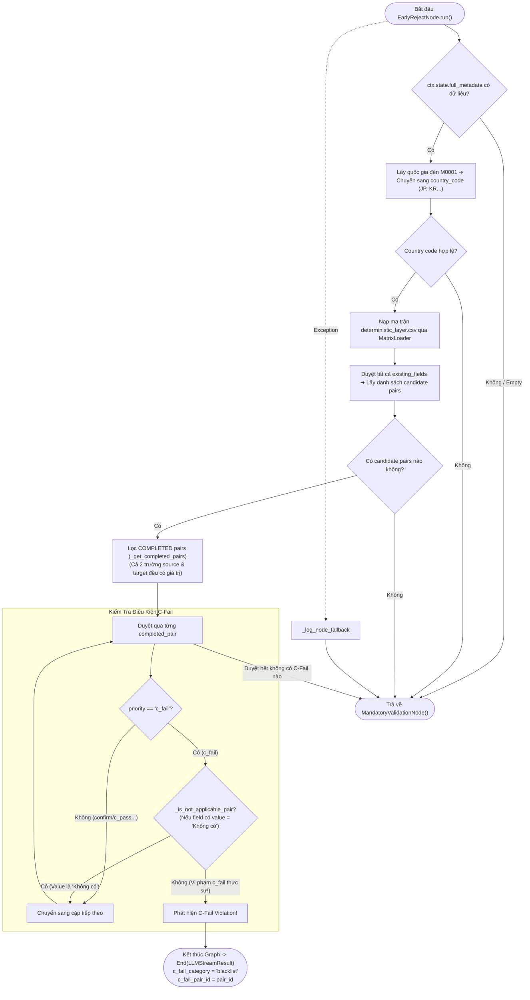

# Phân Tích Chi Tiết EarlyRejectNode (LISA AI Agent)

Tài liệu này phân tích chuyên sâu về kiến trúc, logic kiểm tra điều kiện từ chối sớm (`c_fail` priority) và cơ chế ngắt luồng sớm (Early Abort Flow) của **`EarlyRejectNode`** trong hệ thống LISA AI Agent. Node này chịu trách nhiệm kiểm tra ma trận quyết định định tính (`deterministic_layer.csv`) để phát hiện xem hồ sơ của khách hàng có vi phạm các điều kiện từ chối visa bắt buộc (nợ xấu, trượt visa, có tiền án...) hay không.

---

## 1. Tham Chiếu Mã Nguồn Trực Tiếp (Direct File References)

* **File Node Thực Thi**: [`app/domains/chat/graph/nodes/early_reject.py`](file:///Users/admin/Desktop/Hoang_Huy/lisa-ai-agent/app/domains/chat/graph/nodes/early_reject.py)
* **File Ma Trận Quyết Định**: [`app/domains/suggestion/matrix_loader.py`](file:///Users/admin/Desktop/Hoang_Huy/lisa-ai-agent/app/domains/suggestion/matrix_loader.py)
* **File Định Nghĩa Hằng Số C-Fail**: [`app/domains/metadata/constants.py`](file:///Users/admin/Desktop/Hoang_Huy/lisa-ai-agent/app/domains/metadata/constants.py) (`C_FAIL_METADATA`, `C_FAIL_NONE_VALUE`)
* **File Node Chuyển Tiếp**: [`app/domains/chat/graph/nodes/mandatory_validation.py`](file:///Users/admin/Desktop/Hoang_Huy/lisa-ai-agent/app/domains/chat/graph/nodes/mandatory_validation.py)
* **File Schema Kết Quả Stream**: [`app/domains/chat/graph/results.py`](file:///Users/admin/Desktop/Hoang_Huy/lisa-ai-agent/app/domains/chat/graph/results.py) (`LLMStreamResult`)

---

## 2. Tổng Quan Kiến Trúc, Vai Trò Node & Giải Thích Thuật Ngữ

`EarlyRejectNode` kế thừa từ `BaseNode[ChatState, ChatDeps, ChatResult]` của `pydantic_graph`.
Mục tiêu cốt lõi của node bao gồm 5 chức năng chính kèm giải thích thuật ngữ chuyên sâu:

### 2.1. Phát Hiện Điều Kiện Từ Chối Sớm (`c_fail` Pair Check)
Node đọc ma trận quyết định định tính (`deterministic_layer.csv`) của quốc gia tương ứng (`M0001`) để tìm các cặp trường đã thu thập đủ thông tin (`completed_pairs`) có mức độ ưu tiên là `c_fail`.

> 💡 **Giải thích thuật ngữ: Mức độ ưu tiên `c_fail` là gì?**
> * Trong ma trận quyết định `deterministic_layer.csv`, mối quan hệ giữa hai trường metadata (ví dụ: `M0001` - Quốc gia đến và `O8001` - Blacklist/Nợ xấu) được gán các mức độ ưu tiên: `c_fail`, `confirm`, `c_pass`, hoặc `none`.
> * **`c_fail`** (viết tắt của *Condition Fail* hay *Early Reject*) nghĩa là **"Điều Kiện Từ Chối Sớm / Điều Kiện Trượt Bắt Buộc"**.
> * Nếu một cặp trường có ưu tiên `c_fail` và giá trị thực tế của khách hàng bị vi phạm (ví dụ: có nợ xấu ngân hàng nhóm 5 hoặc từng bị trục xuất), hệ thống đánh giá hồ sơ này **không đủ điều kiện xin visa ngay lập tức** mà không cần tốn thời gian kiểm tra thêm các yếu tố khác.

### 2.2. Thuật Ngữ Cặp Trường Hoàn Thành (`completed_pairs`)
> 💡 **Giải thích thuật ngữ: `completed_pairs` là gì?**
> * Đánh dấu một cặp gồm trường nguồn (`source_field`) và trường đích (`target_field`) mà **cả 2 trường này đều đã có giá trị** trong hồ sơ (`full_metadata`) của khách hàng (ví dụ: đã biết quốc gia đến là `Nhật Bản` VÀ đã biết thông tin nợ xấu `O8001`).
> * `EarlyRejectNode` CHỈ kiểm tra `c_fail` trên các cặp `completed_pairs`. Nếu khách hàng mới chỉ trả lời 1 trong 2 trường, hệ thống chưa đủ căn cứ để kết luận từ chối.

### 2.3. Cơ Chế Bỏ Qua Sentinel `"Không Có"` (`_is_not_applicable_pair`)
Nếu trường thuộc nhóm `C_FAIL_METADATA` (như `O8001` - Blacklist) mang giá trị `"Không có"`, node coi như điều kiện đó KHÔNG vi phạm và bỏ qua.

> 💡 **Giải thích thuật ngữ: Sentinel Value `"Không có"` (`C_FAIL_NONE_VALUE`) là gì?**
> * Khi khách hàng chủ động trả lời phủ định: *"Tôi không bị nợ xấu"*, *"Chưa từng trượt visa"*, hệ thống sẽ gán giá trị đặc biệt này gọi là **Sentinel Value** (Giá trị đánh dấu an toàn).
> * Hàm `_is_not_applicable_pair` nhận diện giá trị này để xác nhận khách hàng **an toàn / không vi phạm**, ngăn chặn việc hệ thống hiểu nhầm và từ chối oan hồ sơ.

### 2.4. Ngắt Luồng Sớm (Early Exit / Abort Graph) & Dữ Liệu `LLMStreamResult`
Nếu phát hiện vi phạm `c_fail` thực sự, Node dừng ngay lập tức mọi bước phía sau (không chạy `MandatoryValidationNode`, không chạy Retrieve Pipeline) và trả về `End(LLMStreamResult)` chứa `c_fail_category="blacklist"` để LLM sinh câu từ chối/cảnh báo lịch sự cho khách hàng.

> 💡 **Giải thích thuật ngữ: `LLMStreamResult` & `c_fail_category` là gì?**
> * **`Early Exit` (Ngắt luồng sớm)**: Dừng ngay tiến trình chạy của Graph để tiết kiệm thời gian chờ và chi phí gọi LLM/Database.
> * **`LLMStreamResult`**: Đóng gói mã cặp trường vi phạm (`c_fail_pair_id`) và phân loại rủi ro (`c_fail_category="blacklist"`). Dữ liệu này được chuyển sang LLM để LLM đóng vai trò tư vấn viên khéo léo, giải thích lý do từ chối một cách nhẹ nhàng và lịch sự với khách hàng.

### 2.5. Chuyển Tiếp An Toàn (`Pass / Delegate`) & Kháng Lỗi `Fail-Open`
Nếu không phát hiện vi phạm `c_fail`, Node trả về `MandatoryValidationNode()` để tiếp tục luồng thẩm định điều kiện bắt buộc.

> 💡 **Giải thích thuật ngữ: Triết lý `Fail-Open Fallback` là gì?**
> * Nghĩa là *"Lỗi kỹ thuật thì mở cửa cho qua"*. Nếu node gặp ngoại lệ bất ngờ (lỗi đọc CSV, lỗi đứt cáp), thay vì ngắt cuộc hội thoại khiến khách hàng gặp lỗi màn hình trắng, node tự động chuyển tiếp khách hàng sang [`MandatoryValidationNode()`](file:///Users/admin/Desktop/Hoang_Huy/lisa-ai-agent/app/domains/chat/graph/nodes/mandatory_validation.py) để luồng chat tiếp tục vận hành thông suốt.

---

## 3. Dynamic State Ownership & Graph Edges

### 3.1. Các Nhánh Kết Nối (Graph Edges)
Node có 2 nhánh chuyển tiếp rõ ràng:
* **Nhánh 1 (`Edge(label="pass / delegate")`)**: Chuyển tiếp tới [`MandatoryValidationNode()`](file:///Users/admin/Desktop/Hoang_Huy/lisa-ai-agent/app/domains/chat/graph/nodes/mandatory_validation.py).
* **Nhánh 2 (`Edge(label="c_fail -> LLM")`)**: Ngắt luồng sớm và trả về `End(LLMStreamResult)` với `exit_node="EarlyRejectNode"`.

---

## 4. Sơ Đồ Luồng Hoạt Động Chi Tiết (Activity Flowchart)



---

## 5. Chi Tiết Các Hàm Xử Lý Mã Nguồn

### 5.1. Lọc Cặp Trường Hoàn Thành (`_get_completed_pairs`)
```python
def _get_completed_pairs(all_candidates, existing_fields):
    completed = []
    for target_field, priority, source_field in all_candidates:
        if source_field in existing_fields and target_field in existing_fields:
            pair_id = "_".join(sorted([source_field, target_field]))
            completed.append((pair_id, priority, source_field, target_field))
    return completed
```
* **Mục đích**: Chỉ xem xét những cặp trường mà khách hàng **đã cung cấp đủ giá trị cho cả 2 trường** (ví dụ: `M0001` - Quốc gia đến và `O8001` - Lịch sử nợ xấu/blacklist).

### 5.2. Kiểm Tra Sentinel Phủ Định (`_is_not_applicable_pair`)
```python
def _is_not_applicable_pair(source_field, target_field, source_value, target_value):
    return (
        source_field in C_FAIL_METADATA and isinstance(source_value, str) and source_value == C_FAIL_NONE_VALUE
    ) or (
        target_field in C_FAIL_METADATA and isinstance(target_value, str) and target_value == C_FAIL_NONE_VALUE
    )
```
* **Mục đích**: Nếu một trường c-fail (như `O8001`) mang giá trị sentinel `"Không có"` (`C_FAIL_NONE_VALUE`), điều đó chứng minh khách hàng **không vi phạm** c-fail ➔ Bỏ qua không kích hoạt ngắt luồng từ chối.

---

## 6. Chiến Lược Quản Lý Lỗi & Fallback Matrix

| Kịch Bản | Hành Vi Của Node | Kết Quả Đạt Được |
| :--- | :--- | :--- |
| `full_metadata` rỗng | Trả về `MandatoryValidationNode()` | Tiếp tục kiểm tra trường bắt buộc. |
| Không resolve được `country_code` từ `M0001` | Trả về `MandatoryValidationNode()` | Tiếp tục luồng bình thường. |
| Không có cặp completed pair nào là `c_fail` | Trả về `MandatoryValidationNode()` | Tiếp tục sang bước thẩm định điều kiện. |
| Phát hiện completed pair `c_fail` thực sự | Trả về `End(LLMStreamResult)` | Ngắt Graph ngay lập tức, LLM tạo phản hồi từ chối. |
| Trường `c_fail` mang giá trị `"Không có"` | Coi như không vi phạm, bỏ qua | Tiếp tục kiểm tra các cặp trường khác. |
| Ngoại lệ không lường trước (Exception) | Bắt lỗi qua `_log_node_fallback`, trả về `MandatoryValidationNode()` | Giúp hệ thống không bị crash, duy trì trải nghiệm người dùng. |

---

## 7. Tổng Kết Ưu Điểm Thiết Kế (Key Takeaways)

1. **Phát Hiện Rủi Ro Sớm (Early Detection)**: Giúp phát hiện sớm các hồ sơ không đủ điều kiện ngay từ ma trận quyết định, tránh tốn chi phí gọi Retrieve Pipeline và LLM ở các bước sau.
2. **Cơ Chế Sentinel Chính Xác**: Phân biệt rành mạch giữa khách hàng *chưa trả lời* vs khách hàng *trả lời "Không có"*, ngăn chặn việc từ chối nhầm các hồ sơ hợp lệ.
3. **Kháng Lỗi Fail-Open**: Luôn sẵn sàng fallback sang `MandatoryValidationNode()` khi gặp sự cố kỹ thuật.
