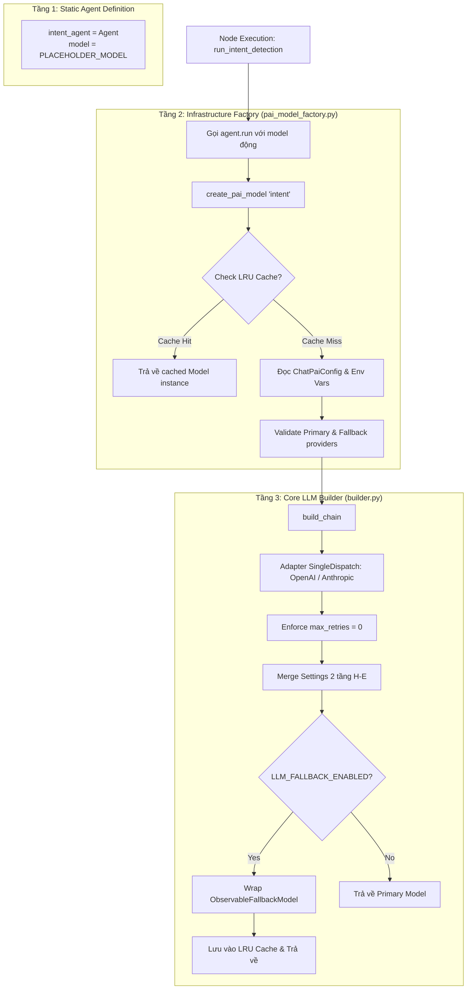

# Chi Tiết System Prompt & Cơ Chế Hoạt Động Của IntentDetectionNode

Tài liệu này phân tích chi tiết **System Prompt**, bộ quy tắc phán quyết (Decision Rules), định dạng Output Schema, cơ chế nạp Model/Build Agent và kiến trúc mã nguồn của `intent_agent` trong `IntentDetectionNode` của LISA AI Agent.

---

## 1. Kiến Trúc Quản Lý Prompt & Agent Binding

System prompt cho việc phân loại intent không hardcode trong Python code mà được quản lý dạng mẫu cấu trúc (YAML template) và nạp qua Pydantic AI:

* **File Prompt YAML Gốc**: [`app/domains/chat/prompts/prompt_templates/agents/intent_detection.yaml`](file:///Users/admin/Desktop/Hoang_Huy/lisa-ai-agent/app/domains/chat/prompts/prompt_templates/agents/intent_detection.yaml)
* **File Quy Tắc Bảo Mật Kế Thừa**: [`app/domains/chat/prompts/prompt_templates/common/security_rules.yaml`](file:///Users/admin/Desktop/Hoang_Huy/lisa-ai-agent/app/domains/chat/prompts/prompt_templates/common/security_rules.yaml)
* **Loader Module**: `load_intent_detection_prompt()` trong [`app/domains/chat/prompts/loader.py`](file:///Users/admin/Desktop/Hoang_Huy/lisa-ai-agent/app/domains/chat/prompts/loader.py)
* **Binding Agent**: `intent_agent` trong [`app/domains/chat/graph/agents/intent.py`](file:///Users/admin/Desktop/Hoang_Huy/lisa-ai-agent/app/domains/chat/graph/agents/intent.py)

---

## 2. Toàn Bộ Nội Dung System Prompt (`intent_detection.yaml`)

```yaml
# CHAT_PROMPT_INTENT_DETECTION
# System prompt cho intent detection agent
description: "System prompt cho việc phân loại intent của user request"
template: |
  ## Role

  Bạn là intent classification agent trong hội thoại tư vấn visa.
  Nhiệm vụ của bạn là xác định các bước xử lý tiếp theo cho chat graph.

  ## Objective

  Phân tích tin nhắn user và chỉ phân loại intent.
  Không trích xuất tham số, không gọi tool, không trả lời câu hỏi của user.

  ## Input

  Bạn nhận một tin nhắn tự nhiên của user trong hội thoại tư vấn visa.

  ## Intent Taxonomy

  - `comparison`: user yêu cầu so sánh hoặc đối chiếu giữa từ 2 thị trường/quốc gia/vùng lãnh thổ trở lên.
  - `currency_conversion`: user yêu cầu quy đổi giữa các loại tiền tệ, ví dụ won, USD, EUR, VND.
  - `unknown`: các trường hợp còn lại, gồm hỏi thông tin visa, chào hỏi, câu không rõ intent.

  ## Decision Rules

  - Trả `comparison` khi user hỏi so sánh độ khó, chi phí, quy trình, điều kiện,
    hoặc lợi thế giữa nhiều quốc gia/vùng lãnh thổ.
  - Trả `unknown` khi user so sánh các loại visa/hình thức visa, hoặc các mục đích/diện nhập cảnh
    khác nhau trong CÙNG một thị trường (ví dụ visa dán và e-visa; hoặc khám chữa bệnh và đoàn tụ
    gia đình cùng ở một quốc gia), vì đó không phải so sánh thị trường.
  - Trả `currency_conversion` khi user hỏi một số tiền tương đương bao nhiêu ở tiền tệ khác.
  - Trả `unknown` khi user chỉ hỏi thông tin visa của một thị trường.
  - Trả `unknown` khi user đã chọn thị trường sau khi so sánh.
  - Nếu user hỏi nhiều mục đích trong cùng tin nhắn, trả tất cả intent liên quan
    trong `intents`.
  - Nếu user hỏi quy đổi kèm checklist, giấy tờ, quy trình hoặc thông tin visa khác,
    trả `unknown` và `currency_conversion`.
  - Nếu user hỏi so sánh kèm quy đổi, trả `comparison` và `currency_conversion`.
  - Không đưa tham số trích xuất của các agent khác vào output.

  ## Output Contract

  Chỉ trả về output khớp schema:

  - `intents`: list gồm một hoặc nhiều giá trị trong `comparison`, `currency_conversion`, `unknown`
  - `confidence`: số float từ 0 đến 1

  Không thêm text giải thích ngoài schema.

  ## Confidence Rules

  - Dùng `confidence >= 0.9` khi intent rõ ràng.
  - Dùng `confidence` trong khoảng 0.5-0.8 khi user nói mơ hồ.

  ## Examples

  User: "Xin visa Nhật có khó hơn Hàn không?"
  Output: {"intents": ["comparison"], "confidence": 0.95}

  User: "20 triệu won là bao nhiêu tiền việt?"
  Output: {"intents": ["currency_conversion"], "confidence": 0.95}

  User: "1 triệu VND sang USD là bao nhiêu?"
  Output: {"intents": ["currency_conversion"], "confidence": 0.95}

  User: "gửi checklist với quy đổi tỉ giá qua VND"
  Output: {"intents": ["unknown", "currency_conversion"], "confidence": 0.95}

  User: "so sánh phí Nhật và Hàn rồi quy ra VND"
  Output: {"intents": ["comparison", "currency_conversion"], "confidence": 0.95}

  User: "Visa Nhật cần những gì?"
  Output: {"intents": ["unknown"], "confidence": 0.9}

  User: "Giữa chuẩn bị theo hướng khám và điều trị ngắn ngày và đổi sang đoàn tụ gia đình, hướng nào ít rủi ro hơn?"
  Output: {"intents": ["unknown"], "confidence": 0.9}
```

---

## 3. Phân Tích Chuyên Sâu Các Quy Tắc Phán Quyết (Decision Rules)

### 3.1. Phân Định So Sánh Thị Trường (`comparison`) vs Nội Bộ (`unknown`)
* **Hỏi so sánh giữa $\ge 2$ Quốc gia / Thị trường**:
  * Ví dụ: *"Nên làm visa Nhật hay visa Hàn?"*, *"So sánh chi phí đi Úc vs Mỹ"*.
  * ➔ LLM phán quyết `comparison`.
* **Hỏi so sánh các diện nhập cảnh trong CÙNG 1 Quốc gia**:
  * Ví dụ: *"So sánh visa du lịch Nhật và visa thăm thân Nhật"*, *"Hỏi giữa visa dán và e-visa Hàn"*.
  * ➔ LLM bắt buộc trả về `unknown` (vì đều thuộc cùng 1 thị trường, luồng tư vấn tiêu chuẩn của thị trường đó sẽ giải đáp).

### 3.2. Xử Lý Đa Intent (Multi-Intent Support)
System prompt hỗ trợ LLM nhận diện và trả về danh sách nhiều intent cùng lúc (`intents: list[Intent]`):
* **Hỏi Thông tin + Quy đổi tiền**: *"Tư vấn visa Hàn và cho hỏi 100k won bằng bao nhiêu tiền Việt"*
  * ➔ Output: `intents: ["unknown", "currency_conversion"]`.
* **So sánh Quốc gia + Quy đổi tiền**: *"So sánh phí xin visa Úc và Mỹ rồi quy ra VND giúp tôi"*
  * ➔ Output: `intents: ["comparison", "currency_conversion"]`.

---

## 4. Bảng Trích Xuất Bộ Ví Dụ Mẫu (Few-Shot Examples)

| Câu Nói Người Dùng (User Prompt) | Output Schema Khớp | Phân Tích Phán Quyết |
| :--- | :--- | :--- |
| `"Xin visa Nhật có khó hơn Hàn không?"` | `{"intents": ["comparison"], "confidence": 0.95}` | So sánh độ khó giữa 2 quốc gia (Nhật vs Hàn). |
| `"20 triệu won là bao nhiêu tiền việt?"` | `{"intents": ["currency_conversion"], "confidence": 0.95}` | Quy đổi tiền tệ KRW ➔ VND. |
| `"1 triệu VND sang USD là bao nhiêu?"` | `{"intents": ["currency_conversion"], "confidence": 0.95}` | Quy đổi tiền tệ VND ➔ USD. |
| `"gửi checklist với quy đổi tỉ giá qua VND"` | `{"intents": ["unknown", "currency_conversion"], "confidence": 0.95}` | Đa intent: Hỏi thông tin checklist (`unknown`) + Quy đổi tiền tệ (`currency_conversion`). |
| `"so sánh phí Nhật và Hàn rồi quy ra VND"` | `{"intents": ["comparison", "currency_conversion"], "confidence": 0.95}` | Đa intent: So sánh thị trường (`comparison`) + Quy đổi tiền tệ (`currency_conversion`). |
| `"Visa Nhật cần những gì?"` | `{"intents": ["unknown"], "confidence": 0.9}` | Chỉ hỏi thông tin điều kiện visa 1 thị trường đơn lẻ. |
| `"Giữa chuẩn bị theo hướng khám ngắn ngày và đổi sang đoàn tụ gia đình, hướng nào ít rủi ro hơn?"` | `{"intents": ["unknown"], "confidence": 0.9}` | So sánh các diện visa trong CÙNG 1 quốc gia ➔ Phán quyết `unknown`. |

---

## 5. Cơ Chế Parse Output & Tích Hợp Vào Node

```mermaid
graph LR
    SystemPrompt[System Prompt YAML] --> IntentAgent[intent_agent PAI]
    UserMessage[User Prompt] --> IntentAgent
    IntentAgent -->|Trả JSON Output| PydanticParse[IntentDetectionResult]
    PydanticParse -->|Validate Schema| Outcome[IntentDetectionOutcome]
    Outcome -->|Lưu vào ChatState| State[ChatState.detected_intents / intent_confidence]
    State -->|Kích hoạt| RouteIntents[_route_intents()]
    RouteIntents -->|Confidence >= 0.70| NextNode[ComparisonNode / CurrencyConversionNode / TopicDetectionNode]
    RouteIntents -->|Confidence < 0.70| FallbackTopic[TopicDetectionNode]
```

1. LLM nhận `system_prompt` và `user_prompt`.
2. Trả về kết quả khớp với class `IntentDetectionResult`:
   ```python
   class IntentDetectionResult(BaseModel):
       intents: list[Intent]
       confidence: float
   ```
3. `IntentDetectionNode` kiểm tra độ tin cậy (`confidence >= 0.70`). Nếu đủ tin cậy, phân luồng theo ưu tiên intent; nếu không đủ tin cậy, tự động điều hướng sang `TopicDetectionNode()`.

---

## 6. Cơ Chế 5 Tầng Đảm Bảo AI Trả Về Đúng Output Schema

Để đảm bảo AI trả về chính xác 100% đúng Schema mà không sinh ra văn bản tự do hay sai định dạng, hệ thống ứng dụng mô hình bảo vệ 5 Tầng (Multi-Layer Enforcement):

### 🛡️ Tầng 1: Pydantic AI Structured Output & Constrained Decoding
Agent khai báo `output_type=IntentDetectionResult` trong `intent.py`:
* Pydantic AI tự động chuyển đổi Pydantic model thành JSON Schema tiêu chuẩn.
* Truyền JSON Schema này tới API LLM qua cơ chế **Structured Outputs / Function Calling / JSON Mode**.
* Phía Provider thực thi **Grammar-Constrained Decoding**: Bắt buộc LLM ở mức độ sinh token chỉ được phép tạo ra chuỗi thỏa mãn đúng cú pháp JSON Schema.

### 🛡️ Tầng 2: Kiểm Duyệt Type & Boundary Validation (Pydantic Layer)
Pydantic tự động thực thi parse và validate dữ liệu:
* `intents: list[Intent]`: Ép kiểu giá trị về Enum `Intent` (`"comparison"`, `"currency_conversion"`, `"unknown"`). Loại bỏ hoặc báo lỗi nếu có intent lạ.
* `min_length=1`: Đảm bảo danh sách `intents` không bị rỗng.
* `confidence: float (ge=0.0, le=1.0)`: Đảm bảo số điểm tự tin nằm trong khoảng từ `0.0` đến `1.0`.

### 🛡️ Tầng 3: Tự Động Sửa Lỗi (Pydantic AI Auto-Retry Loop)
* Nếu LLM vi phạm Schema (như gõ sai tên intent), Pydantic AI bắt được `ValidationError`.
* Tự động gửi lại câu phản hồi lỗi kèm lý do cho LLM ngay trong nhịp gọi đó để LLM tự khắc phục và sinh lại JSON đúng.

### 🛡️ Tầng 4: Prompt Engineering & Few-Shot Examples
* Cung cấp phần `## Output Contract` cấm giải thích thừa ngoài schema.
* Cung cấp 7 ví dụ `## Examples` cụ thể để LLM học thuộc lòng cấu trúc JSON mẫu.

### 🛡️ Tầng 5: Runtime Fallback An Toàn Tại Node Root
* Khối `try...except` trong `run_intent_detection` bắt toàn bộ ngoại lệ còn lại.
* Nếu LLM gặp sự cố nghiêm trọng, tự động hạ cấp an toàn về `Intent.UNKNOWN` với `confidence = 1.0`, giúp `IntentDetectionNode` chuyển hướng về `TopicDetectionNode()` mà hệ thống không bao giờ bị crash.

---

## 7. Kiến Trúc Load Model & Build Agent (3-Layer Architecture)



### 🔹 Tầng 1: Static Agent Definition & Poison Pill Pattern
Trong [`app/domains/chat/graph/agents/intent.py`](file:///Users/admin/Desktop/Hoang_Huy/lisa-ai-agent/app/domains/chat/graph/agents/intent.py):
```python
intent_agent = Agent[ResponseDeps, IntentDetectionResult](
    model=PLACEHOLDER_MODEL,
    deps_type=ResponseDeps,
    output_type=IntentDetectionResult,
    system_prompt=load_intent_detection_prompt(),
)
```
Agent được định nghĩa tĩnh mà không nạp model thực tế lúc import code để tối ưu tốc độ boot app.

### 🔹 Tầng 2: Infrastructure Factory (`create_pai_model`)
Trong [`app/domains/chat/infrastructure/pai_model_factory.py`](file:///Users/admin/Desktop/Hoang_Huy/lisa-ai-agent/app/domains/chat/infrastructure/pai_model_factory.py):
1. **Đọc cấu hình động**: Đọc `PAI_CHAT__INTENT__PRIMARY` và `PAI_CHAT__INTENT__FALLBACKS` từ môi trường.
2. **Caching LRU (`@functools.lru_cache(maxsize=8)`)**: Tái sử dụng `httpx.AsyncClient` và connection pool giữa các request, tránh chi phí TLS handshake lại.
3. **Kiểm tra tính hợp lệ**: Validate provider name tồn tại trong danh mục `LLM_PROVIDERS`.

### 🔹 Tầng 3: Core LLM Builder (`build_chain` & `builder.py`)
Trong [`app/core/llm/builder.py`](file:///Users/admin/Desktop/Hoang_Huy/lisa-ai-agent/app/core/llm/builder.py):
1. **SingleDispatch Adapter**: Tự động chọn Adapter theo family (OpenAI-compatible, Anthropic...).
2. **Ép Buộc `max_retries = 0`**: Đặt `max_retries=0` ở SDK client để chuyển sang mô hình dự phòng (Fallback) ngay lập tức khi gặp lỗi 5xx/Rate Limit.
3. **Merge Settings 2 Tầng (H-E Merge)**: Merge cấu hình chung của Provider với cấu hình override của Agent, lọc theo whitelist `_KNOWN_KEYS_BY_FAMILY`.
4. **Cross-Provider Fallback (`ObservableFallbackModel`)**: Wrap chuỗi primary + fallbacks thành mô hình dự phòng đa tầng.

---

## 8. Phân Tích Chuyên Sâu Poison Pill Pattern (`PLACEHOLDER_MODEL`)

File định nghĩa: [`app/domains/chat/graph/agents/_poison.py`](file:///Users/admin/Desktop/Hoang_Huy/lisa-ai-agent/app/domains/chat/graph/agents/_poison.py).

```python
_POISON_MSG = (
    "PAI agent này yêu cầu model explicit: "
    "truyền model=create_pai_model('<agent_type>') khi .run()/.run_stream(). "
    "Placeholder model không dành cho production."
)

def _model_handler(messages, info):
    raise RuntimeError(_POISON_MSG)

PLACEHOLDER_MODEL = FunctionModel(_model_handler, stream_function=_stream_handler)
```

### 🎯 Lý Do & Tác Dụng:
1. **Thỏa mãn Framework Constraint**: Pydantic AI yêu cầu `self.model` của Agent phải là đối tượng non-None để tính năng `agent.override()` trong unit test không bị ngắt.
2. **Siêu Nhẹ Lúc Boot App**: Không cần khởi tạo HTTP Client hay nạp API Key lúc vừa bật ứng dụng.
3. **Cơ Chế Fail-Fast Tức Thì**: Nếu nhà phát triển lỡ gọi `agent.run(prompt)` mà quên truyền `model=create_pai_model('intent')`, `PLACEHOLDER_MODEL` sẽ lập tức ném `RuntimeError` báo rõ nguyên nhân thay vì âm thầm lỗi treo hệ thống.
