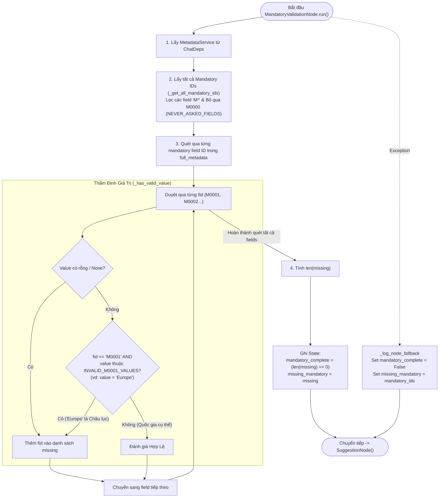

# Phân Tích Chi Tiết MandatoryValidationNode (LISA AI Agent)

Tài liệu này phân tích chuyên sâu về kiến trúc, quy tắc kiểm tra các trường bắt buộc (Mandatory Fields `M*`), quy tắc đặc thù cho quốc gia `M0001` và cơ chế thẩm định hồ sơ của **`MandatoryValidationNode`** trong hệ thống LISA AI Agent. Node này chịu trách nhiệm kiểm tra xem khách hàng đã cung cấp đủ các thông tin bắt buộc tối thiểu để tư vấn visa hay chưa trước khi chuyển giao luồng sang `SuggestionNode`.

---

## 1. Tham Chiếu Mã Nguồn Trực Tiếp (Direct File References)

* **File Node Thực Thi**: [`app/domains/chat/graph/nodes/mandatory_validation.py`](file:///Users/admin/Desktop/Hoang_Huy/lisa-ai-agent/app/domains/chat/graph/nodes/mandatory_validation.py)
* **File Định Nghĩa Hằng Số Metadata**: [`app/domains/metadata/constants.py`](file:///Users/admin/Desktop/Hoang_Huy/lisa-ai-agent/app/domains/metadata/constants.py) (`MANDATORY_FIELD_PREFIX`, `NEVER_ASKED_FIELDS`, `INVALID_M0001_VALUES`)
* **File Metadata Service & Registry**: [`app/domains/metadata/service.py`](file:///Users/admin/Desktop/Hoang_Huy/lisa-ai-agent/app/domains/metadata/service.py)
* **File Node Chuyển Tiếp**: [`app/domains/chat/graph/nodes/suggestion.py`](file:///Users/admin/Desktop/Hoang_Huy/lisa-ai-agent/app/domains/chat/graph/nodes/suggestion.py)
* **File Quản Lý Chat State**: [`app/domains/chat/graph/state.py`](file:///Users/admin/Desktop/Hoang_Huy/lisa-ai-agent/app/domains/chat/graph/state.py)

---

## 2. Tổng Quan Kiến Trúc, Vai Trò Node & Giải Thích Thuật Ngữ

`MandatoryValidationNode` kế thừa từ `BaseNode[ChatState, ChatDeps, ChatResult]` của `pydantic_graph`.
Mục tiêu cốt lõi của node bao gồm 4 chức năng chính kèm giải thích thuật ngữ chuyên sâu:

### 2.1. Thẩm Định Các Trường Bắt Buộc Mandatory (`M*`)
Node quét qua toàn bộ danh mục các trường thông tin trong `MetadataRegistry` để lọc ra các trường có mã bắt đầu bằng chữ `"M"` (`MANDATORY_FIELD_PREFIX = "M"`), ngoại trừ các trường không bao giờ hỏi người dùng.

> 💡 **Giải thích thuật ngữ: Các trường Mandatory (`M*`) là gì?**
> * Là nhóm **thông tin hồ sơ tối thiểu bắt buộc phải có** để Lisa có thể tra cứu ma trận quyết định và đưa ra tư vấn visa.
> * Ví dụ các trường Mandatory: `M0001` (Quốc gia đến), `M0002` (Mục đích chuyến đi), `M0003` (Thời gian lưu trú), `M0004` (Diện visa tự túc/tour).

### 2.2. Loại Bỏ Trường Thụ Động `M0000` (`NEVER_ASKED_FIELDS`)
> 💡 **Giải thích thuật ngữ: `NEVER_ASKED_FIELDS` là gì?**
> * Trong danh sách trường `M*`, riêng trường **`M0000` ("Chủ đề")** được đưa vào danh sách `NEVER_ASKED_FIELDS`.
> * `M0000` chỉ được AI trích xuất thụ động để phục vụ phân luồng kiến thức, **hệ thống tuyệt đối không bao giờ chủ động đặt câu hỏi yêu cầu khách hàng trả lời `M0000`**. Vì vậy `M0000` bị gạch tên khỏi danh sách kiểm tra thiếu/đủ của Mandatory.

### 2.3. Quy Tắc Loại Bỏ Tên Châu Lục Ở Trường `M0001` (`INVALID_M0001_VALUES`)
> 💡 **Giải thích thuật ngữ: Tại sao `M0001 = "Europe"` bị coi là Không Hợp Lệ?**
> * Trường `M0001` đại diện cho **Quốc gia đến**.
> * Nếu khách hàng nói *"Tôi muốn đi Châu Âu"* (`M0001 = "Europe"`), giá trị `"Europe"` nằm trong danh mục `INVALID_M0001_VALUES` (Tên châu lục thay vì quốc gia cụ thể).
> * **Lý do nghiệp vụ**: Lisa không thể tra cứu quy định visa cho cả một Châu lục chung chung. Khách hàng bắt buộc phải chỉ định một quốc gia cụ thể trong khối Schengen (như Pháp, Đức, Ý...). Vì vậy, hàm `_has_valid_value` đánh giá `"Europe"` là không hợp lệ, ép `M0001` vào danh sách `missing_mandatory` để trợ lý AI chủ động hỏi lại khách hàng quốc gia cụ thể.

### 2.4. Cập Nhật Trạng Thái & Chuyển Tải Chuyển Tiếp Sang `SuggestionNode`
* Đếm số trường còn thiếu trong `missing: list[str]`.
* Nếu `len(missing) == 0` ➔ `ctx.state.mandatory_complete = True` (Hồ sơ đã đủ 100% trường bắt buộc).
* Nếu `len(missing) > 0` ➔ `ctx.state.mandatory_complete = False` và `ctx.state.missing_mandatory = missing`.
* Luôn trả về `SuggestionNode()` để chuyển giao luồng.

---

## 3. Dynamic State Ownership (Các Trường State Độc Quyền)

Node trực tiếp quản lý và cập nhật 2 trường dữ liệu sau trên `ChatState` ([`state.py`](file:///Users/admin/Desktop/Hoang_Huy/lisa-ai-agent/app/domains/chat/graph/state.py)):

| Trường State | Kiểu Dữ Liệu | Mô Tả Chức Năng |
| :--- | :--- | :--- |
| `mandatory_complete` | `bool` | Cờ boolean xác nhận hồ sơ đã thu thập ĐỦ 100% các trường bắt buộc chưa (`True`/`False`). |
| `missing_mandatory` | `list[str]` | Danh sách mã các trường bắt buộc còn thiếu (vd: `["M0001", "M0003"]`). |

---

## 4. Sơ Đồ Luồng Hoạt Động Chi Tiết (Activity Flowchart)



---

## 5. Phân Tích Logic Chi Tiết Các Hàm Mã Nguồn

### 5.1. Hàm Trích Xuất Mandatory IDs (`_get_all_mandatory_ids`)
```python
def _get_all_mandatory_ids(metadata_service: MetadataService) -> list[str]:
    if not metadata_service.has_registry:
        return []
    all_ids = metadata_service.get_registry_ids()
    return [
        fid
        for fid in all_ids
        if fid.startswith(MANDATORY_FIELD_PREFIX) and fid not in NEVER_ASKED_FIELDS
    ]
```
* **Chức năng**: Trả về danh sách tất cả các trường có tiền tố `"M"` trong Registry, loại trừ trường `M0000`.

### 5.2. Hàm Thẩm Định Hợp Lệ (`_has_valid_value`)
```python
def _has_valid_value(value: str | None, field_id: str = "") -> bool:
    if value is None:
        return False
    if field_id == "M0001" and value in INVALID_M0001_VALUES:
        return False
    return True
```
* **Chức năng**: Đảm bảo giá trị không rỗng VÀ chặn việc dùng tên Châu lục `"Europe"` làm quốc gia đến `M0001`.

### 5.3. Cơ Chế Kháng Lỗi Giữ Nguyên Danh Sách Thiếu (Best-Effort Exception Fallback)
```python
except Exception as e:
    _log_node_fallback(...)
    ctx.state.mandatory_complete = False
    ctx.state.missing_mandatory = mandatory_ids
```
* **Điểm sáng thiết kế**: Khi gặp exception, hệ thống giữ nguyên danh sách `mandatory_ids` đã tính toán thay vì gán danh sách rỗng `[]`. Điều này ngăn không cho các node phía sau hiểu nhầm rằng "hồ sơ đã đủ 100%", đảm bảo an toàn tuyệt đối cho luồng tư vấn.

---

## 6. Bảng Ma Trận Kháng Lỗi (Fallback Strategy Matrix)

| Kịch Bản | Hành Vi Của Node | Kết Quả Đạt Được |
| :--- | :--- | :--- |
| Tất cả trường `M*` đều có giá trị hợp lệ | Ghi `mandatory_complete = True`, `missing_mandatory = []` | Downstream node biết hồ sơ đã hoàn thiện. |
| Thiếu trường `M0003` (Thời gian ở lại) | Ghi `mandatory_complete = False`, `missing_mandatory = ["M0003"]` | Downstream node (`SuggestionNode`) sẽ ưu tiên hỏi về `M0003`. |
| Khách hàng nói `M0001 = "Europe"` | Coi `M0001` không hợp lệ, đưa `M0001` vào `missing_mandatory` | Đẩy gợi ý cho LLM hỏi lại quốc gia Schengen cụ thể. |
| Exception không lường trước tại Node | Bắt lỗi, set `mandatory_complete = False`, `missing_mandatory = mandatory_ids` | Giữ nguyên danh sách thiếu, không làm crash graph. |

---

## 7. Tổng Kết Ưu Điểm Thiết Kế (Key Takeaways)

1. **Chuẩn Hóa Kiểm Tra Hồ Sơ**: Tự động hóa việc rà soát các thông tin tối thiểu bắt buộc qua Registry.
2. **Quy Tắc Nghiệp Vụ Thực Tế**: Chặn tên Châu lục `"Europe"` đối với trường quốc gia đến `M0001`, ép khách hàng làm rõ quốc gia cụ thể.
3. **Cơ Chế Kháng Lỗi Thông Minh**: Giữ nguyên danh sách `missing_mandatory` khi gặp sự cố kỹ thuật để chống hiểu nhầm sai lệch thông tin hồ sơ.
