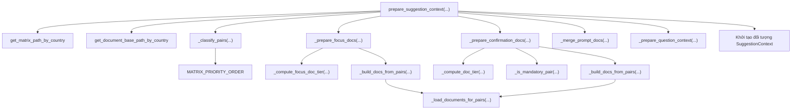

# Phân Tích Chi Tiết Các Hàm Trong SuggestionService (LISA AI Agent)

Tài liệu này phân tích chi tiết logic hoạt động, thuật toán phân loại cặp trường, cơ chế nạp tài liệu thông minh (Attention-Aware Sorting, Focus Docs, Confirmation Docs) và chiến lược xây dựng câu hỏi tiếp theo của tất cả các hàm trong class **`SuggestionService`** ([`app/domains/suggestion/service.py`](file:///Users/admin/Desktop/Hoang_Huy/lisa-ai-agent/app/domains/suggestion/service.py)).

---

## 1. Tham Chiếu Mã Nguồn Trực Tiếp (Direct File References)

* **File Service Thực Thi**: [`app/domains/suggestion/service.py`](file:///Users/admin/Desktop/Hoang_Huy/lisa-ai-agent/app/domains/suggestion/service.py)
* **File Hằng Số Suggestion**: [`app/domains/suggestion/constants.py`](file:///Users/admin/Desktop/Hoang_Huy/lisa-ai-agent/app/domains/suggestion/constants.py) (`DOC_PRIORITY_TIERS`, `FOCUS_DOC_PRIORITY_TIERS`, `MATRIX_PRIORITY_ORDER`, `MAX_DOCS`, `MAX_FOCUS_DOCS`)
* **File Nạp Ma Trận**: [`app/domains/suggestion/matrix_loader.py`](file:///Users/admin/Desktop/Hoang_Huy/lisa-ai-agent/app/domains/suggestion/matrix_loader.py)
* **File Nạp Tài Liệu Markdown**: [`app/domains/suggestion/document_loader.py`](file:///Users/admin/Desktop/Hoang_Huy/lisa-ai-agent/app/domains/suggestion/document_loader.py)
* **File Schemas Suggestion**: [`app/domains/suggestion/schemas.py`](file:///Users/admin/Desktop/Hoang_Huy/lisa-ai-agent/app/domains/suggestion/schemas.py) (`SuggestionContext`, `SuggestionPriority`)

---

## 2. Tổng Quan Kiến Trúc & Sơ Đồ Gọi Hàm (Function Call Map)

---

## 3. Phân Tích Chi Tiết Từng Function Trong `SuggestionService`

### 3.1. `__init__(self, metadata_service: MetadataService)`
* **Chức năng**: Khởi tạo service với dependency `MetadataService` để phân giải mô tả trường (`description`) và danh sách giá trị cho phép (`allowed_values`).
* **Đặc điểm**: `MatrixLoader` và `DocumentLoader` không khởi tạo cố định trong `__init__` mà được tạo runtime linh hoạt theo `country_code` của từng request khách hàng.

### 3.2. `get_matrix_path_by_country(country_code)` & `get_document_base_path_by_country(country_code)`
* **Chức năng**: Build đường dẫn tuyệt đối/tương đối tới thư mục dữ liệu thị trường (`MARKET_DATA_BASE_PATH / country_code / deterministic_layer.csv` và `MARKET_DATA_BASE_PATH / country_code`).

### 3.3. `identify_changed_fields(prior_metadata, current_metadata)`
* **Chức năng**: Phát hiện các trường metadata mới được thêm vào hoặc bị thay đổi giá trị giữa 2 lượt chat (Delta-based detection).
* **Logic**:
  * Duyệt qua `current_metadata.details()`.
  * Nếu `field_id` chưa từng tồn tại trong `prior_metadata` ➔ Đưa vào `changed_fields`.
  * Nếu đã tồn tại nhưng `prior_metadata[field_id].value != current_metadata[field_id].value` ➔ Đưa vào `changed_fields`.
* **Ý nghĩa nghiệp vụ**: Phục vụ thuật toán sắp xếp ưu tiên đẩy bài viết đối chiếu mới (New Confirmation Docs) lên đầu.

### 3.4. `_is_mandatory_pair(pair_id)` (Static Method)
* **Logic**: Tách `pair_id` bằng dấu gạch dưới `_`. Trả về `True` nếu cả 2 trường trong cặp đều bắt đầu bằng chữ `"M"` (ví dụ `M0001_M0002`).

### 3.5. `_compute_doc_tier(pair_tuple, new_field_ids)`
* **Chức năng**: Tính toán con số Tier ưu tiên (số nhỏ = ưu tiên cao hơn) cho tài liệu đối chiếu (Confirmation Docs) dựa trên 3 tiêu chí:
  1. **Mức độ ưu tiên của cặp**: `c_fail` > `c_pass` > `confirm`.
  2. **Loại cặp**: `mandatory` (cặp chứa 2 trường `M*`) > `other`.
  3. **Tính thời sự (Newness)**: `new` (có chứa trường vừa cập nhật lượt này trong `new_field_ids`) > `old`.
* **Logic ghép khóa**: Tạo `tier_key = f"{priority}_{pair_type}_{newness}"` và tra cứu trong dictionary `DOC_PRIORITY_TIERS`.

### 3.6. `_compute_focus_doc_tier(pair_tuple)`
* **Chức năng**: Tính Tier ưu tiên cho tài liệu trọng tâm (Focus Docs).
* **Logic ghép khóa**: Tạo `tier_key = f"{priority}_{pair_type}"` và tra cứu trong `FOCUS_DOC_PRIORITY_TIERS`.

### 3.7. `_classify_pairs(all_candidates, existing_fields, absent_never_asked)`
* **Chức năng**: Phân loại danh sách candidate thu thập từ ma trận CSV thành 2 nhóm:
  * **`completed`**: Cả `source_field` VÀ `target_field` đều thuộc `existing_fields` (đã có đủ giá trị).
  * **`missing`**: `source_field` đã có (hoặc thuộc `absent_never_asked`), nhưng `target_field` CHƯA có giá trị.
* **Quy tắc đặc thù với `NEVER_ASKED_FIELDS` (`M0000`)**:
  * Các trường không bao giờ hỏi (như `M0000` - Chủ đề) được chấp nhận làm `source_field` để bài viết của nó vẫn được nạp vào prompt.
  * Tuy nhiên, nếu bản thân cặp chứa trường `absent_never_asked` nhưng chưa có value ➔ Bỏ qua không đưa vào `missing`, vì hệ thống tuyệt đối không lấy trường không bao giờ hỏi để làm câu hỏi tiếp theo!
* **Deduplication**: Chuẩn hóa `pair_id = "_".join(sorted([source_field, target_field]))` để tránh lặp lại cùng một cặp khi ma trận emit theo 2 chiều `(A,B)` và `(B,A)`.
* **Sắp xếp**: Sắp xếp cả 2 danh sách theo `MATRIX_PRIORITY_ORDER` (`c_fail` ➔ `c_pass` ➔ `confirm`).

### 3.8. `_load_documents_for_pairs(pair_ids, document_loader)`
* **Chức năng**: Quét qua danh sách `pair_ids`, kiểm tra sự tồn tại của file bài viết `.md` qua `document_loader.exists(pair_id)`. Nếu có, đọc nội dung file trả về `dict[pair_id, content]`. Skip an toàn các file không tồn tại hoặc lỗi đọc.

### 3.9. `_build_docs_from_pairs(pairs, document_loader)`
* **Chức năng**: Chuyển đổi danh sách `pairs` thành dictionary hoàn chỉnh chứa tên hiển thị đẹp (`display_name`) và nội dung (`content`).
* **Tên hiển thị (`display_name`)**: Đọc mô tả tiếng Việt của từng trường từ Registry và ghép thành `f"{source_desc}_{target_desc}"` (ví dụ `"Quốc gia đến_Số lần nhập cảnh"`).

### 3.10. `_prepare_confirmation_docs(completed_pairs, document_loader, new_field_ids)`
* **Chức năng**: Chuẩn bị tài liệu đối chiếu từ các cặp đã hoàn thành (`completed_pairs`).
* **Thuật toán Attention-Aware**:
  1. Tách `completed_pairs` thành nhóm `new_docs` (chứa metadata mới) và `old_docs`.
  2. Sắp xếp `new_docs` theo `_compute_doc_tier` đẩy lên trước.
  3. Sắp xếp `old_docs` theo `_compute_doc_tier` xếp phía sau.
  4. Lọc các file thực sự tồn tại trên đĩa.
  5. Cắt giới hạn tối đa `MAX_DOCS` (12 bài viết) trước khi đọc file để tiết kiệm bộ nhớ và không vượt budget prompt.

### 3.11. `_prepare_focus_docs(existing_fields, absent_never_asked, mentioned_fields, matrix_loader, document_loader)`
* **Chức năng**: Tải bài viết tập trung khi người dùng chủ động đề cập/hỏi về các trường thông tin chưa điền (`mentioned_fields`).
* **Thuật toán Công Bằng (Round-Robin Allocation)**:
  * Nhóm các candidate pairs theo từng trường được đề cập (`target_field`).
  * Duyệt vòng tròn (Round-Robin) lần lượt bốc từng bài viết có Tier cao nhất của mỗi trường cho đến khi đạt giới hạn `MAX_FOCUS_DOCS` (6 bài viết). Điều này đảm bảo nếu người dùng hỏi 2 chủ đề cùng lúc, cả 2 chủ đề đều có tài liệu trong prompt mà không bị chủ đề nào chiếm dụng hết không gian.

### 3.12. `_prepare_question_context(missing_pairs, document_loader)`
* **Chức năng**: Tìm cặp trường thích hợp nhất để tạo câu hỏi tiếp theo cho khách hàng.
* **Logic**:
  * Duyệt qua danh sách `missing_pairs` theo thứ tự ưu tiên của ma trận.
  * Cặp đầu tiên có bài viết câu hỏi tồn tại và nạp thành công sẽ được chọn ➔ Trả về `(target_field, question_doc, suggestion_priority)`.
  * **Fallback**: Nếu tất cả các `missing_pairs` đều không có file `.md`, lấy ngay `target_field` của cặp thiếu đầu tiên và chấp nhận `question_doc = None`.

### 3.13. `_merge_prompt_docs(focus_docs, confirmation_docs)`
* **Chức năng**: Trộn Focus Docs và Confirmation Docs thành một dictionary thống nhất.
* **Quy tắc xếp hàng**: Ghép Focus Docs đứng TRƯỚC Confirmation Docs để đảm bảo thông tin khách hàng trực tiếp hỏi luôn nằm ở vùng chú ý cao nhất trong prompt của LLM. Kiểm soát giới hạn tổng `MAX_DOCS`.

### 3.14. `prepare_suggestion_context(metadata, mentioned_fields, new_field_ids)` (Public API Core)
* **Chức năng**: Hàm xử lý trung tâm (Pipeline Orchestrator). Kết nối tất cả các sub-functions phía trên thành quy trình 6 bước hoàn chỉnh để trả về đối tượng `SuggestionContext`.

---

## 4. Bảng Summary Các Functions Trong `SuggestionService`

| Tên Function | Loại | Mục Đích Chính |
| :--- | :--- | :--- |
| `__init__` | Instance | Nhận dependency `MetadataService`. |
| `get_matrix_path_by_country` | Instance | Lấy đường dẫn file CSV ma trận theo quốc gia. |
| `get_document_base_path_by_country` | Instance | Lấy đường dẫn thư mục bài viết theo quốc gia. |
| `identify_changed_fields` | Instance | Phát hiện các trường metadata biến đổi (Delta). |
| `_is_mandatory_pair` | Static | Kiểm tra cặp trường có phải là cặp `M* - M*` bắt buộc. |
| `_compute_doc_tier` | Instance | Tính Tier ưu tiên cho Confirmation Docs (new vs old). |
| `_compute_focus_doc_tier` | Instance | Tính Tier ưu tiên cho Focus Docs. |
| `_classify_pairs` | Instance | Phân loại candidates thành `completed` vs `missing`. |
| `_load_documents_for_pairs` | Instance | Đọc nội dung file markdown cho danh sách pair IDs. |
| `_build_docs_from_pairs` | Instance | Tạo dict docs chứa `display_name` tiếng Việt và `content`. |
| `_prepare_confirmation_docs` | Instance | Xử lý Attention-Aware sorting & budget limit cho Confirmation Docs. |
| `_prepare_focus_docs` | Instance | Phân bổ bài viết công bằng (Round-Robin) cho các trường `mentioned_fields`. |
| `_prepare_question_context` | Instance | Trích xuất trường đích & bài viết câu hỏi tiếp theo. |
| `_merge_prompt_docs` | Instance | Trộn Focus Docs đứng trước Confirmation Docs. |
| `prepare_suggestion_context` | Public API | Điều phối toàn bộ Pipeline tạo `SuggestionContext`. |
