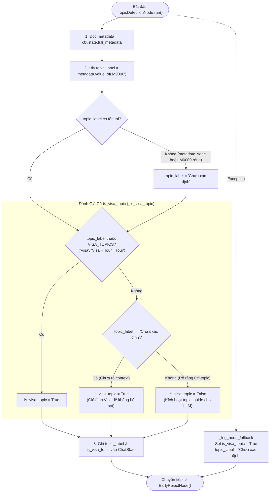

# Phân Tích Chi Tiết TopicDetectionNode (LISA AI Agent)

Tài liệu này phân tích chuyên sâu về kiến trúc, logic xác định chủ đề visa và cơ chế phân nhánh của **`TopicDetectionNode`** trong hệ thống LISA AI Agent. Node này chịu trách nhiệm phát hiện xem cuộc hội thoại có thuộc chủ đề tư vấn visa/tour hay không dựa trên trường metadata `M0000` ("Chủ đề"), từ đó thiết lập trạng thái cho các node tạo phản hồi phía sau.

---

## 1. Tham Chiếu Mã Nguồn Trực Tiếp (Direct File References)

* **File Node Thực Thi**: [`app/domains/chat/graph/nodes/topic_detection.py`](file:///Users/admin/Desktop/Hoang_Huy/lisa-ai-agent/app/domains/chat/graph/nodes/topic_detection.py)
* **File Định Nghĩa Hằng Số Metadata**: [`app/domains/metadata/constants.py`](file:///Users/admin/Desktop/Hoang_Huy/lisa-ai-agent/app/domains/metadata/constants.py) (`VISA_TOPICS`, `TOPIC_LABEL_UNKNOWN`, `NEVER_ASKED_FIELDS`)
* **File Node Chuyển Tiếp**: [`app/domains/chat/graph/nodes/early_reject.py`](file:///Users/admin/Desktop/Hoang_Huy/lisa-ai-agent/app/domains/chat/graph/nodes/early_reject.py)
* **File Chat State Management**: [`app/domains/chat/graph/state.py`](file:///Users/admin/Desktop/Hoang_Huy/lisa-ai-agent/app/domains/chat/graph/state.py)

---

## 2. Tổng Quan Kiến Trúc & Vai Trò Node

`TopicDetectionNode` kế thừa từ `BaseNode[ChatState, ChatDeps, ChatResult]` của `pydantic_graph`.
Mục tiêu cốt lõi của node bao gồm:

1. **Trích Xuất Nhãn Chủ Đề (`M0000`)**: Đọc giá trị trường `M0000` từ `full_metadata`. Nếu chưa có dữ liệu, gán nhãn mặc định `"Chưa xác định"` (`TOPIC_LABEL_UNKNOWN`).
2. **Xác Định Cờ Chủ Đề Visa (`is_visa_topic`)**: Đánh giá nhãn chủ đề qua 3 nhánh quyết định để thiết lập cờ boolean `is_visa_topic`.
3. **Triết Lý "Không Chặn Oan" (Forgiving Topic Check)**: Nếu chủ đề ở trạng thái `"Chưa xác định"`, hệ thống luôn ngầm định `is_visa_topic = True` để không bỏ sót các câu chào hỏi ban đầu hoặc các câu thoại chưa đủ ngữ cảnh.
4. **Xử Lý Off-Topic Linh Hoạt Nhờ LLM**: Nếu xác định rõ ràng là off-topic (`is_visa_topic = False`), Node không ngắt luồng mà vẫn chuyển giao tiếp sang [`EarlyRejectNode()`](file:///Users/admin/Desktop/Hoang_Huy/lisa-ai-agent/app/domains/chat/graph/nodes/early_reject.py). Ở các bước sinh phản hồi tiếp theo, LLM sẽ nhận chỉ dẫn `topic_guide` để chủ động định hướng người dùng quay lại chủ đề visa một cách lịch sự.
5. **Cơ Chế Kháng Lỗi (Fallback Always Continue)**: Nếu gặp ngoại lệ, tự động gán `is_visa_topic = True`, `topic_label = "Chưa xác định"` và luôn chuyển tiếp sang `EarlyRejectNode()`.

---

## 3. Dynamic State Ownership (Các Trường State Độc Quyền)

`TopicDetectionNode` quản lý và cập nhật trực tiếp 2 trường dữ liệu sau trên `ChatState` ([`state.py`](file:///Users/admin/Desktop/Hoang_Huy/lisa-ai-agent/app/domains/chat/graph/state.py)):

| Trường State | Kiểu Dữ Liệu | Mô Tả Chức Năng |
| :--- | :--- | :--- |
| `topic_label` | `str` | Nhãn chủ đề trích xuất được từ trường `M0000` (vd: `"Visa"`, `"Visa + Tour"`, `"Tour"`, `"Chưa xác định"`...). |
| `is_visa_topic` | `bool` | Cờ đánh dấu hội thoại có thuộc chủ đề visa/tour hay không (`True`/`False`). |

---

## 4. Sơ Đồ Luồng Hoạt Động (Activity Flowchart)

---

## 5. Chi Tiết Logic Đánh Giá Chủ Đề (Decision Logic Breakdown)

### 5.1. Quy Tắc Lấy Nhãn Chủ Đề (`_get_topic_label`)
* Đọc từ `M0000` ("Chủ đề") trong `ChatState.full_metadata`.
* Trường `M0000` thuộc nhóm `NEVER_ASKED_FIELDS` trong [`constants.py`](file:///Users/admin/Desktop/Hoang_Huy/lisa-ai-agent/app/domains/metadata/constants.py#L18): Hệ thống trích xuất thụ động từ câu thoại chứ không bao giờ chủ động đặt câu hỏi yêu cầu người dùng điền `M0000`.
* Nếu `metadata` chưa được khởi tạo hoặc `M0000` rỗng ➔ Trả về hằng số `TOPIC_LABEL_UNKNOWN` (`"Chưa xác định"`).

### 5.2. 3 Nhánh Đánh Giá Cờ `is_visa_topic` (`_is_visa_topic`)
Hàm `_is_visa_topic(topic_label)` trong [`topic_detection.py`](file:///Users/admin/Desktop/Hoang_Huy/lisa-ai-agent/app/domains/chat/graph/nodes/topic_detection.py#L32-L47) phân định theo 3 nhánh rõ ràng:

1. **Nhánh 1: Đúng Chủ Đề Visa (`topic_label in VISA_TOPICS`)** ➔ `is_visa_topic = True`.
   * Các giá trị hợp lệ trong `VISA_TOPICS` ([`constants.py`](file:///Users/admin/Desktop/Hoang_Huy/lisa-ai-agent/app/domains/metadata/constants.py#L383)): `"Visa"`, `"Visa + Tour"`, `"Tour"`.
2. **Nhánh 2: Chưa Xác Định (`topic_label == "Chưa xác định"`)** ➔ `is_visa_topic = True`.
   * **Triết lý thiết kế**: Khi câu thoại quá ngắn (ví dụ: *"Xin chào"*, *"Em chào anh"*) hoặc ở các lượt chat đầu tiên khi LLM chưa đủ dữ liệu để gán `M0000`, hệ thống **thà giả định là True hơn là từ chối nhầm**.
3. **Nhánh 3: Xác Định Rõ Off-Topic (`topic_label` thuộc giá trị khác)** ➔ `is_visa_topic = False`.
   * Khi `M0000` được trích xuất là chủ đề khác (ví dụ: `"Du lịch"`, `"Khác"`...).
   * Khi `is_visa_topic = False`, ở tầng tạo phản hồi (Prompt Builder), hệ thống sẽ chèn đoạn hướng dẫn `topic_guide` vào `response_conditions`, yêu cầu LLM lịch sự hướng dẫn người dùng quay lại chủ đề xin visa.

---

## 6. Chiến Lược Quản Lý Lỗi & Chuyển Tải Graph

| Kịch Bản | Hành Vi Của Node | Kết Quả Đạt Được |
| :--- | :--- | :--- |
| `M0000` trích xuất thành công | Ghi nhãn & tính `is_visa_topic` | Graph chuyển tiếp sang [`EarlyRejectNode()`](file:///Users/admin/Desktop/Hoang_Huy/lisa-ai-agent/app/domains/chat/graph/nodes/early_reject.py). |
| `M0000` trống / chưa trích xuất | Ghi nhãn `"Chưa xác định"`, `is_visa_topic = True` | Graph không bị ngắt, cho phép người dùng tiếp tục hội thoại. |
| `topic_label` xác định off-topic | Ghi `is_visa_topic = False` | Graph vẫn chuyển tiếp sang [`EarlyRejectNode()`](file:///Users/admin/Desktop/Hoang_Huy/lisa-ai-agent/app/domains/chat/graph/nodes/early_reject.py), LLM xử lý off-topic khéo léo. |
| Ngoại lệ không lường trước (Exception) | Bắt lỗi qua `_log_node_fallback`, set `is_visa_topic = True`, `topic_label = "Chưa xác định"` | Đảm bảo Graph không bao giờ bị crash, luôn chuyển hướng sang [`EarlyRejectNode()`](file:///Users/admin/Desktop/Hoang_Huy/lisa-ai-agent/app/domains/chat/graph/nodes/early_reject.py). |

---

## 7. Tổng Kết Ưu Điểm Thiết Kế (Key Takeaways)

1. **Kiểm Tra Chủ Đề Bao Dung (Forgiving Check)**: Cơ chế mặc định `True` cho nhãn `"Chưa xác định"` giúp tránh việc chặn nhầm lượt chat ở những câu chào hỏi ban đầu.
2. **Điều Hướng Khéo Léo Qua Prompt Instead of Hard-Stop**: Thay vì ngắt kết nối ngay khi off-topic, node ghi cờ `is_visa_topic = False` để LLM xử lý bằng ngôn ngữ tự nhiên mềm mỏng.
3. **100% Non-Blocking Execution**: Node luôn trả về [`EarlyRejectNode()`](file:///Users/admin/Desktop/Hoang_Huy/lisa-ai-agent/app/domains/chat/graph/nodes/early_reject.py), đảm bảo luồng Pydantic-Graph vận hành thông suốt.
