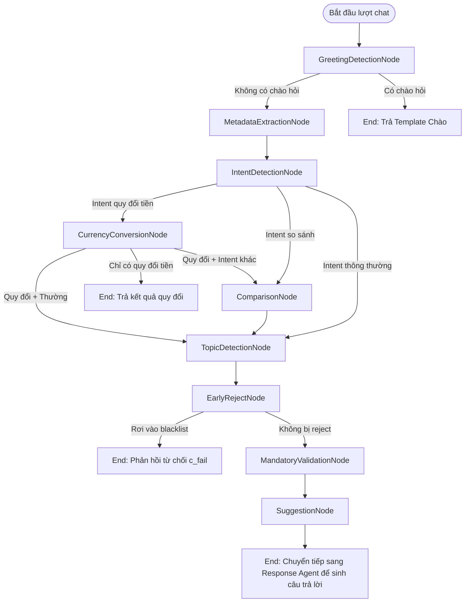

# Phân Tích Hệ Thống Graph Nodes & System Prompts (LISA AI Agent)

Tài liệu này phân tích chuyên sâu về danh sách các Node trong Chat Graph (`chat_graph`) của LISA AI Agent, tính chất hoạt động (quyết định hay gọi LLM), cấu trúc System Prompt và cách lắp ghép Prompt động ở bước phản hồi cuối cùng.

---

## 1. Tổng Quan Về Kiến Trúc Chat Graph
LISA AI Agent sử dụng thư viện `pydantic-graph` để quản lý các bước xử lý tin nhắn của khách hàng. Mỗi lượt hội thoại được biểu diễn bằng một đồ thị có hướng (Graph) bao gồm 9 Node chính. 

Mục tiêu của Graph là **phân tích ý định (intent), trích xuất thông tin khách hàng cung cấp (metadata), xác định sự đầy đủ của thông tin (mandatory validation), và chuẩn bị sẵn tài liệu nghiệp vụ (retrieval)**. Việc sinh câu trả lời bằng LLM thực tế được tách riêng ra ngoài Graph và chạy sau cùng.

Sơ đồ chuyển trạng thái giữa các Node trong một lượt chạy hoàn chỉnh:



---

## 2. Chi Tiết Danh Sách Nodes & System Prompts

Dưới đây là phân tích chi tiết của từng Node trong hệ thống, bao gồm vai trò, tính chất và các prompt tương ứng.

### 2.1. `GreetingDetectionNode`
* **Vai trò**: Phát hiện các câu chào hỏi xã giao của người dùng ở lượt trò chuyện đầu tiên nhằm phản hồi nhanh chóng mà không cần tốn chi phí gọi LLM.
* **Tính chất**: **Deterministic (Quyết định)**. Sử dụng bộ lọc biểu thức chính quy (Regex) và logic chuỗi thông qua lớp `GreetingDetector` (lazy-loaded singleton).
* **Đầu vào/Đầu ra**: 
  - *Đầu vào*: Lịch sử hội thoại từ `ChatDeps`.
  - *Đầu ra*: `MetadataExtractionNode` (nếu hội thoại dài hơn 1 lượt hoặc không khớp câu chào) hoặc kết thúc sớm với `TemplateResult` chứa nội dung câu chào mẫu.
* **System Prompt**: Không có.

### 2.2. `MetadataExtractionNode`
* **Vai trò**: Trích xuất toàn bộ các thông tin nghiệp vụ visa (metadata) mà khách hàng cung cấp, đồng thời xác định intent và các trường thông tin người dùng đang hỏi trực tiếp.
* **Tính chất**: **Hybrid (Kết hợp Tool + LLM Agents chạy song song)**.
* **Logic hoạt động**:
  1. Gọi `metadata_service.extract_with_tool` (thành phần `tool100` trích xuất nhanh).
  2. Lấy ra danh sách các trường thông tin đã được tool trích xuất với độ tin cậy tuyệt đối (`EXACTLY`) để bỏ qua, tránh việc LLM phải trích xuất lặp lại.
  3. Phân chia các trường thông tin còn thiếu vào các nhóm trích xuất (Extraction Units) theo cấu hình nhóm (`metadata_extract_config.groups`).
  4. Thực thi song song thông qua `asyncio.gather`:
     - Trích xuất metadata cho từng nhóm thông tin còn thiếu.
     - Phân loại Intent của người dùng (`run_intent_detection`).
     - Trích xuất nhu cầu thông tin so sánh/hỏi của người dùng (`extract_information_needs`).
  5. Cập nhật và lưu trữ kết quả trích xuất vào `ChatState`.
* **Đầu vào/Đầu ra**: 
  - *Đầu vào*: Lịch sử hội thoại, Metadata Registry hiện tại.
  - *Đầu ra*: Chuyển tiếp sang `IntentDetectionNode`.
* **Hệ thống Prompts của Node**:
  Do chạy nhiều Agent song song, Node này sử dụng các prompt chuyên biệt sau:
  
  #### A. Prompt trích xuất Metadata Nhóm (Group/Batched Extraction)
  - *Đường dẫn file gốc*: `app/domains/metadata/extraction_prompts.yaml` (dưới khóa `group_templates.frontier_v1`).
  - *Cấu trúc prompt*:
    ```markdown
    [Khung sườn template frontier_v1]
    Mô tả nhóm thông tin cần trích xuất: {group_desc}
    Các trường thông tin cần trích xuất và quy tắc chi tiết:
    {fields_block}
    ```
    Nội dung `{fields_block}` được sinh động từ Metadata Registry chứa mô tả của từng trường, danh sách giá trị hợp lệ (`allowed_values`) và các quy tắc đặc thù. Kết quả trả về bắt buộc khớp định dạng JSON có cấu trúc.
  
  #### B. Prompt trích xuất Metadata Đơn (Per-field Extraction - dành cho Model 7B cục bộ)
  - *Đường dẫn file gốc*: `app/domains/metadata/extraction_prompts.yaml` (dưới khóa `column_prompts.{field_id}`).
  - *Cấu trúc*: Định nghĩa system prompt và gợi ý suy luận (Chain of Thought - `cot_hints`) riêng biệt cho từng mã trường để tối ưu hóa khả năng trích xuất của mô hình nhỏ được finetuned.

  #### C. Prompt trích xuất Intent (`intent_agent`)
  - *Đường dẫn file gốc*: `app/domains/chat/prompts/prompt_templates/agents/intent_detection.yaml` (gộp thêm quy tắc bảo mật từ `common/security_rules.yaml`).
  - *Nội dung chính*:
    - Định nghĩa phân loại 3 Intent: `comparison` (so sánh liên thị trường), `currency_conversion` (quy đổi tiền tệ), và `unknown` (hỏi thông tin visa thông thường hoặc chào hỏi).
    - Quy định rõ luật phân loại: chỉ trả `comparison` khi so sánh giữa các quốc gia khác nhau, trả `unknown` nếu so sánh các diện visa trong cùng một quốc gia.
    - Định dạng đầu ra: Trả về JSON chứa danh sách `intents` và điểm số độ tin cậy `confidence`.

  #### D. Prompt trích xuất Nhu cầu thông tin (`information_need_agent`)
  - *Nguồn*: Định nghĩa dưới dạng hằng số `_PROMPT_TEMPLATE` trong file `app/domains/chat/graph/agents/information_need.py`.
  - *Nội dung chính*:
    - Hướng dẫn mô hình phân tích tin nhắn người dùng để tìm xem họ đang chủ động hỏi hoặc đề cập đến những trường metadata nào mà chưa cung cấp giá trị (ví dụ: "Visa đi Nhật có mấy loại?" -> User đang hỏi về trường "Diện visa" `M0004`).
    - Hướng dẫn nhận diện ý định so sánh lựa chọn (ví dụ: "Visa single hay multiple entry?" -> operation: `compare`, candidates: `["Single entry", "Multiple entry"]`).

### 2.3. `IntentDetectionNode`
* **Vai trò**: Định tuyến luồng xử lý của Graph dựa trên Intent đã phân loại.
* **Tính chất**: **Logic Router & Fallback**.
* **Logic hoạt động**:
  - Nếu ở `MetadataExtractionNode` đã chạy trích xuất intent thành công và độ tin cậy vượt ngưỡng `_INTENT_ROUTING_CONFIDENCE_THRESHOLD` (0.70), Node này sẽ định tuyến trực tiếp dựa trên kết quả có sẵn trong State để tránh gọi LLM lần hai.
  - Nếu chưa có thông tin intent trong State, Node sẽ gọi LLM tuần tự (`run_intent_detection`) làm phương án dự phòng (fallback).
* **Đầu vào/Đầu ra**: 
  - *Đầu ra*: Định tuyến sang `ComparisonNode`, `CurrencyConversionNode` hoặc `TopicDetectionNode`.
* **System Prompt**: Trùng với prompt trích xuất intent của `intent_agent` (`intent_detection.yaml`).

### 2.4. `ComparisonNode`
* **Vai trò**: Xác định các quốc gia/thị trường mà khách hàng muốn so sánh và nạp tài liệu tương ứng.
* **Tính chất**: **LLM-based (PAI Agent)**.
* **Logic hoạt động**:
  1. Chạy `comparison_agent` để trích xuất danh sách các quốc gia cần so sánh.
  2. Gọi `ComparisonDocLoaderTool` để tìm kiếm tài liệu so sánh lưu trữ cục bộ.
  3. Với các quốc gia thiếu tài liệu, hệ thống kích hoạt cuộc gọi song song tới `market_research` agent để thực hiện cứu vãn (research thông tin qua web search) với giới hạn thời gian (timeout) là 30 giây. Nếu thất bại, hệ thống sử dụng tài liệu tĩnh mặc định làm fallback.
* **Đầu vào/Đầu ra**: 
  - *Đầu ra*: Chuyển tiếp sang `TopicDetectionNode`.
* **System Prompt**:
  - *Đường dẫn file gốc*: `app/domains/chat/prompts/prompt_templates/agents/comparison.yaml` (gộp thêm `security_rules.yaml`).
  - *Nội dung chính*: Yêu cầu trích xuất tên quốc gia chuẩn bằng tiếng Anh dạng short-form (ví dụ: Mỹ -> "United States", Nhật -> "Japan"). Cấm tự viết nội dung so sánh ở bước này.

### 2.5. `CurrencyConversionNode`
* **Vai trò**: Thực hiện tính toán và quy đổi các khoản tiền tệ theo yêu cầu của khách hàng.
* **Tính chất**: **LLM-based (PAI Agent tích hợp Tool tính toán)**.
* **Logic hoạt động**:
  1. Chạy `currency_agent` để phân tích số tiền, đơn vị tiền nguồn và đơn vị tiền đích từ tin nhắn của khách hàng.
  2. Gọi tool `convert_currencies` để thực hiện tính toán quy đổi tỉ giá chính xác (đảm bảo LLM không tự tính toán gây sai lệch số học).
  3. Lấy kết quả trả về từ tool để tạo văn bản phản hồi (`response_text`).
  4. Nếu có intent phụ đi kèm, lưu văn bản quy đổi vào `prepared_response_contexts` trên State và chuyển tiếp hành trình. Nếu chỉ có duy nhất intent quy đổi tiền, kết thúc sớm Graph.
* **Đầu vào/Đầu ra**:
  - *Đầu ra*: `End(TemplateResult)` (kết thúc sớm với văn bản quy đổi) hoặc chuyển tiếp sang `ComparisonNode` / `TopicDetectionNode`.
* **System Prompt**:
  - *Đường dẫn file gốc*: `app/domains/chat/prompts/prompt_templates/agents/currency.yaml` (gộp thêm `security_rules.yaml` và `response_style.yaml`).
  - *Nội dung chính*: Hướng dẫn trích xuất các tham số quy đổi tiền, quy tắc định dạng số tiền (ví dụ: "20 triệu" -> 20000000), quy định sử dụng kết quả từ tool để viết câu trả lời và thêm ghi chú tỉ giá tham khảo.

### 2.6. `TopicDetectionNode`
* **Vai trò**: Xác định tin nhắn của khách hàng có thuộc phạm vi tư vấn visa hay không.
* **Tính chất**: **Deterministic (Quyết định)**.
* **Logic hoạt động**: 
  - Đọc trường metadata `M0000` (Chủ đề).
  - Nếu giá trị của `M0000` nằm trong danh sách chủ đề được hỗ trợ (`VISA_TOPICS`) hoặc chưa xác định (`Topic Unknown`), hệ thống gán `is_visa_topic = True`. 
  - Nếu giá trị khẳng định rõ ràng là chủ đề khác (off-topic), gán `is_visa_topic = False` (để kích hoạt luật từ chối khéo léo trong prompt ở bước sau).
* **Đầu vào/Đầu ra**:
  - *Đầu ra*: Chuyển tiếp sang `EarlyRejectNode`.
* **System Prompt**: Không có.

### 2.7. `EarlyRejectNode`
* **Vai trò**: Kiểm tra xem khách hàng có rơi vào các trường hợp bị cấm nhập cảnh hoặc hạn chế xin visa (blacklist) của quốc gia đến hay không.
* **Tính chất**: **Deterministic (Quyết định)**.
* **Logic hoạt động**:
  - Duyệt qua các cặp completed pairs trong ma trận quyết định.
  - Tìm kiếm bất kỳ cặp nào có thuộc tính ưu tiên là `c_fail` (ví dụ: cặp tương tác giữa Lịch sử du lịch và Blacklist).
  - Nếu phát hiện điều kiện fail và người dùng không khai báo trạng thái loại trừ (`C_FAIL_NONE_VALUE`), Graph sẽ ngắt lập tức (Short-circuit) và trả về `LLMStreamResult` kèm cấu hình lỗi `c_fail_category = "blacklist"`.
* **Đầu vào/Đầu ra**:
  - *Đầu ra*: Kết thúc sớm với `LLMStreamResult` (hướng dẫn phản hồi c_fail) hoặc chuyển tiếp sang `MandatoryValidationNode`.
* **System Prompt**: Không có trong node. Nhưng khi kết thúc sớm, nó sẽ cấu hình để `response_agent` ở bước sau sử dụng prompt từ chối `answer_cfail.yaml`.

### 2.8. `MandatoryValidationNode`
* **Vai trò**: Xác minh tính đầy đủ của các trường dữ liệu bắt buộc của quốc gia đến.
* **Tính chất**: **Deterministic (Quyết định)**.
* **Logic hoạt động**:
  - Quét qua toàn bộ các trường bắt buộc (bắt đầu bằng `M` trừ `M0000`) trong Metadata Registry của quốc gia đến.
  - Đối chiếu với metadata khách hàng hiện tại để tìm các trường còn thiếu.
  - Đánh dấu `mandatory_complete = True/False` và cập nhật danh sách các trường còn thiếu vào `missing_mandatory`.
* **Đầu vào/Đầu ra**:
  - *Đầu ra*: Chuyển tiếp sang `SuggestionNode`.
* **System Prompt**: Không có.

### 2.9. `SuggestionNode`
* **Vai trò**: Đóng gói dữ liệu đề xuất từ Pipeline Retrieve để chuẩn bị kết thúc luồng đi của Graph.
* **Tính chất**: **Deterministic (Quyết định)**.
* **Logic hoạt động**:
  - Gọi `SuggestionService` thu thập tài liệu xác nhận và đề xuất câu hỏi tiếp theo dựa trên thông tin còn thiếu.
  - Xây dựng widget lựa chọn nhanh dưới dạng JSON (`user_choice_json`) cho Frontend hiển thị nếu cần thiết.
* **Đầu vào/Đầu ra**:
  - *Đầu ra*: Kết thúc Graph, trả về kết quả `LLMStreamResult` chứa toàn bộ ngữ cảnh dữ liệu và tài liệu đã được chuẩn bị sẵn.
* **System Prompt**: Không có.

---

## 3. Luồng Phản Hồi Cuối Cùng (`response_agent`)

Sau khi Graph kết thúc và trả về kết quả `LLMStreamResult`, dịch vụ chat (`ChatService`) sẽ chạy `response_agent` để sinh phản hồi thực tế trả về cho khách hàng.

### 3.1. Cơ chế Instruction Dynamic
Thông thường, `pydantic-ai` chỉ đính kèm `system_prompt` vào lượt hội thoại đầu tiên (khi history rỗng). Với các lượt chat tiếp theo, LLM sẽ chỉ nhận lịch sử hội thoại và tin nhắn của người dùng mà mất đi các chỉ thị hệ thống quan trọng.

Để khắc phục điều này, `response_agent` sử dụng bộ trang trí `@response_agent.instructions` để **tái dựng và cập nhật System Prompt động cho mỗi lượt chạy bất kể lịch sử hội thoại dài bao nhiêu**.

### 3.2. Cấu Trúc Lắp Ghép Prompt Động
System Prompt được lắp ghép động thông qua hàm `build_chat_system_prompt` tùy thuộc vào kết quả trả về từ Graph:

#### Kịch Bản 1: Phát hiện điều kiện loại trừ sớm (c_fail)
Nếu Graph dừng tại `EarlyRejectNode`, System Prompt được xây dựng bằng template `chat_cfail.yaml`:
- `{header}`: Thông tin định danh hệ thống.
- `{metadata}`: Metadata hiện tại của khách hàng.
- `{security_rules}`: Các quy tắc bảo mật thông tin nội bộ.
- `{response_style}`: Quy tắc văn phong, xưng hô, cấm đại từ bên thứ ba mơ hồ.
- `{greeting_instruction}`: Hướng dẫn chào hỏi.
- `{visa_domain_rules}`: Quy định chung về nghiệp vụ visa.
- `{prepared_context}`: Ngữ cảnh phụ (nếu có).
- `{answer_cfail}` (Tải từ `answer_cfail.yaml`): Chỉ thị bắt buộc LLM giải thích lý do cấm nhập cảnh dựa trên cặp metadata bị lỗi, đưa ra hướng giải quyết và khuyên khách hàng tìm luật sư di trú. **Đặc biệt yêu cầu không hỏi thêm gì khác**.

#### Kịch Bản 2: Thiếu dữ liệu bắt buộc hoặc Có chủ đề đặc biệt (Off-topic)
Nếu khách hàng thiếu metadata bắt buộc (`mandatory_complete == False`) hoặc tin nhắn thuộc chủ đề ngoài visa, prompt sử dụng template `chat_condition.yaml`:
- Gồm tất cả các phần chung như trên.
- Thay thế phần câu hỏi nghiệp vụ bằng `{response_conditions}` (Tải từ `response_conditions.yaml` kết hợp `response_guides.yaml`):
  - *unassigned_topic*: Hướng dẫn từ chối khéo léo và giới thiệu phạm vi tư vấn visa nếu câu hỏi không liên quan đến visa.
  - *non_visa_topic*: Chỉ thị tương tự khi xác định tin nhắn rõ ràng không phải visa.

#### Kịch Bản 3: Đầy đủ dữ liệu bắt buộc (Luồng tư vấn nghiệp vụ chính)
Khi thông tin bắt buộc đã đầy đủ, prompt sử dụng template `chat_default.yaml`:
- Gồm tất cả các phần chung.
- Đính kèm `{task_1}` (Tải từ `task_1.yaml`):
  - Quy định quy trình 2 bước: Tìm kiếm trong tài liệu được cung cấp trước, sau đó chỉ trả lời dựa trên tài liệu đã tìm thấy.
  - Nghiêm cấm dùng kiến thức có sẵn để tư vấn các nước không có trong tài liệu.
  - Quy tắc xử lý thẻ khóa `<key>...</key>` (giữ nguyên thẻ từ tài liệu gốc, không tự ý thêm/bớt).
  - Quy định xuống dòng bắt buộc khi viết nội dung có chữ "Lưu ý:".
  - Chèn tài liệu xác nhận nghiệp vụ đã retrieve thành công (`{confirmation_section}`).
- Đính kèm `{task_2}` (Tải từ `task_2.yaml`):
  - Chỉ thị đặt câu hỏi thu thập trường thông tin còn thiếu tiếp theo dựa trên tài liệu hướng dẫn đặt câu hỏi nghiệp vụ (`{knowledge_for_missing_metadata}`) và widget JSON (`{ask_user_choice_guide}`).
  - Giới hạn số câu hỏi đặt ra tối đa là 1 câu.
