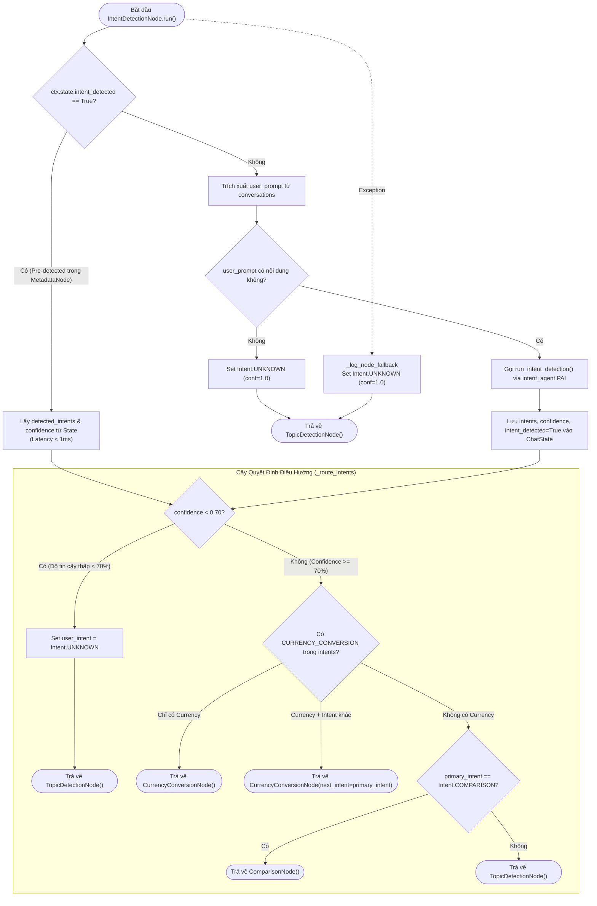

# Phân Tích Chi Tiết IntentDetectionNode (LISA AI Agent)

Tài liệu này phân tích chuyên sâu về kiến trúc, luồng phân nhánh (routing logic), và cơ chế hoạt động của **`IntentDetectionNode`** trong hệ thống LISA AI Agent. Node này đóng vai trò là "trạm điều hướng giao thông" (Traffic Router) của Graph, quyết định luồng hội thoại sẽ đi tiếp sang subagent chuyên trách nào (`ComparisonNode`, `CurrencyConversionNode`, hay `TopicDetectionNode`).

---

## 1. Tổng Quan Kiến Trúc & Vai Trò Node

`IntentDetectionNode` kế thừa từ `BaseNode[ChatState, ChatDeps, ChatResult]` của `pydantic_graph`.
Mục tiêu cốt lõi của node bao gồm:

1. **Phân Luồng Dựa Trên Ý Định (Intent-Based Routing)**: Định hướng lượt chat đến đúng Node xử lý phù hợp dựa trên phân tích ngôn ngữ tự nhiên câu hỏi của người dùng.
2. **Tận Dụng Kết Quả Pre-Detection (Parallel Optimization)**: Nếu `MetadataExtractionNode` đã phát hiện Intent ở nhịp `asyncio.gather` trước đó (`ctx.state.intent_detected == True`), Node sẽ thực hiện route ngay tức thì (**< 1ms**) mà không cần gọi lại LLM.
3. **Cơ Chế Sequential Fallback**: Nếu intent chưa được pre-detect (hoặc luồng trước bị bỏ qua), Node mới tự động gọi `intent_agent` để phân loại intent tuần tự.
4. **Lọc Ngưỡng Tin Cậy (Confidence Threshold Guard)**: Nếu độ tin cậy của intent thấp hơn `0.70` (70%), Node sẽ an toàn hạ cấp intent về `UNKNOWN` và điều hướng sang `TopicDetectionNode()`.
5. **Hỗ Trợ Đa Ý Định (Multi-Intent Chaining)**: Xử lý linh hoạt trường hợp vừa hỏi quy đổi tiền tệ vừa yêu cầu so sánh (ví dụ: `CURRENCY_CONVERSION` + `COMPARISON`) bằng cách lưu vết qua tham số `next_intent`.

---

## 2. Dynamic State Ownership (Các Trường State Độc Quyền)

Node trực tiếp quản lý và cập nhật 4 trường dữ liệu sau trên `ChatState`:

| Trường State | Kiểu Dữ Liệu | Mô Tả Chức Năng |
| :--- | :--- | :--- |
| `user_intent` | `Intent` | Intent chính được lựa chọn để phân luồng (vd: `COMPARISON`, `CURRENCY_CONVERSION`, `UNKNOWN`). |
| `detected_intents` | `list[Intent]` | Danh sách tất cả các intent phát hiện được (dạng danh sách để hỗ trợ đa intent). |
| `intent_confidence` | `float` | Độ tin cậy của mô hình classification (giá trị từ `0.0` đến `1.0`). |
| `intent_detected` | `bool` | Cờ đánh dấu đã hoàn tất việc nhận diện intent (tránh gọi LLM trùng lặp). |

---

## 3. Sơ Đồ Luồng Hoạt Động (Flowchart & Decision Tree)

Sơ đồ dưới đây biểu diễn luồng thực thi và cây quyết định điều hướng trong `IntentDetectionNode`:

---

## 4. Chi Tiết Các Quy Tắc Điều Hướng (Routing Business Rules)

### 4.1. Ngưỡng Tin Cậy (`_INTENT_ROUTING_CONFIDENCE_THRESHOLD = 0.70`)
* Khi `intent_confidence < 0.70`, hệ thống coi đây là phán đoán không chắc chắn.
* `state.user_intent` và `state.detected_intents` sẽ được đưa về `Intent.UNKNOWN`.
* Luồng được an toàn chuyển hướng về `TopicDetectionNode()` để xử lý câu hỏi thường hoặc tư vấn quy định visa tiêu chuẩn.

### 4.2. Xử Lý Quy Đổi Tiền Tệ (`Intent.CURRENCY_CONVERSION`)
* **Trường hợp Đơn Ý Định (`CURRENCY_CONVERSION` duy nhất)**:
  * Trực tiếp chuyển sang `CurrencyConversionNode()`.
* **Trường hợp Đa Ý Định (Chuỗi Chuyển Tiếp `next_intent`)**:
  * Nếu người dùng vừa hỏi quy đổi tiền tệ vừa có ý định so sánh/tư vấn (ví dụ: *"1000 USD đổi ra bao nhiêu JPY và so sánh điều kiện visa Nhật vs Hàn"*):
  * Node sẽ trả về `CurrencyConversionNode(next_intent=primary_intent)` để ưu tiên quy đổi tiền tệ trước, sau đó lưu vết `next_intent` để luồng tự động chuyển tiếp sang node so sánh sau khi hoàn thành đổi tiền.

### 4.3. Xử Lý So Sánh Thị Trường (`Intent.COMPARISON`)
* Khi `primary_intent == Intent.COMPARISON` (người dùng hỏi so sánh điều kiện/hồ sơ giữa 2 hoặc nhiều quốc gia):
* Trực tiếp chuyển hướng sang `ComparisonNode()`.

### 4.4. Luồng Mặc Định (`Intent.UNKNOWN` & Các Intent Khác)
* Mọi intent không rơi vào các trường hợp đặc biệt trên sẽ được điều hướng sang `TopicDetectionNode()`.

---

## 5. Chiến Lược Quản Lý Lỗi (Exception Fallback)

Node áp dụng cơ chế tự phục hồi lỗi 100%:
* Khi gặp ngoại lệ bất ngờ trong quá trình gọi LLM hoặc xử lý intent:
  1. Ghi log cảnh báo qua `_log_node_fallback`.
  2. Gán `ctx.state.user_intent = Intent.UNKNOWN` và `ctx.state.intent_confidence = 1.0`.
  3. Đánh dấu `ctx.state.intent_detected = True`.
  4. Trả về `TopicDetectionNode()` để cuộc trò chuyện tiếp tục diễn ra bình thường mà người dùng không nhận biết được sự cố rào cản kỹ thuật.

---

## 6. Tổng Kết Ưu Điểm Kiến Trúc (Key Advantages)

1. **Tốc Độ Vượt Trội Nhờ Parallel Pre-Detection**: Tối đa hóa hiệu năng bằng cách phát hiện intent song song tại `MetadataExtractionNode`, giúp `IntentDetectionNode` chuyển hướng chỉ trong **< 1ms**.
2. **An Toàn Bằng Ngưỡng Confidence**: Chống phân loại nhầm nhờ rào chắn ngưỡng tin cậy `70%`.
3. **Mở Rộng Đa Ý Định (Multi-Intent Chaining)**: Khả năng nối chuỗi xử lý (`next_intent`) giúp giải quyết các câu hỏi phức tạp ghép nhiều tác vụ của người dùng.
