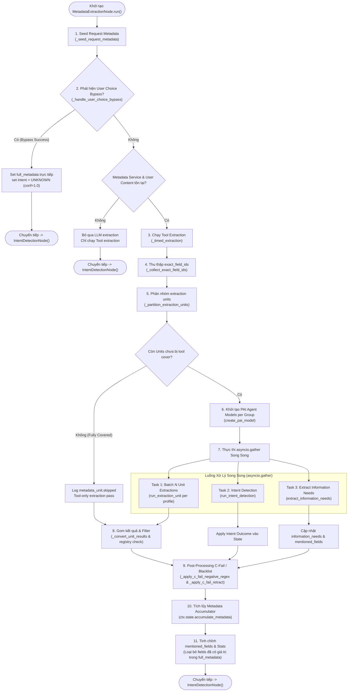

# Phân Tích Chi Tiết MetadataExtractionNode (LISA AI Agent)

Tài liệu này phân tích chuyên sâu về kiến trúc, luồng xử lý và cơ chế hoạt động của **`MetadataExtractionNode`** trong hệ thống LISA AI Agent. Node này đóng vai trò cửa ngõ chính trong việc trích xuất, hợp nhất (merge) và tích lũy (accumulate) thông tin hồ sơ khách hàng (metadata) từ hội thoại, phát hiện intent và nhu cầu thông tin trước khi chuyển sang các node xử lý tiếp theo trong Pydantic-Graph.

> [!NOTE]
> Tài liệu này tập trung chuyên sâu vào luồng xử lý của `MetadataExtractionNode`, cơ chế phân nhóm song song (PAI Agents), bypass qua UI widget, xử lý c-fail/blacklist và quản lý state. Chi tiết về bộ trích xuất quy tắc `tool100` được bỏ qua theo yêu cầu.

---

## 1. Tổng Quan Kiến Trúc & Vai Trò Node

`MetadataExtractionNode` kế thừa từ `BaseNode[ChatState, ChatDeps, ChatResult]` của `pydantic_graph`. Mục tiêu cốt lõi của node bao gồm:

1. **Khởi Tạo & Bảo Toàn State (`_seed_request_metadata`)**: Đảm bảo metadata ban đầu từ client request luôn được nạp vào accumulator để tránh mất mát dữ liệu cũ.
2. **Tối Ưu Phản Hồi Qua User Choice Bypass (`_handle_user_choice_bypass`)**: Nhận diện tức thì khi người dùng tương tác trực tiếp với các widget lựa chọn (`ask_user_choice`) từ câu hỏi trước của Assistant để cập nhật thẳng metadata mà không cần gọi LLM.
3. **Phân Nhóm & Trích Xuất Song Song (`_partition_extraction_units` & `asyncio.gather`)**: Tự động phân chia các trường metadata chưa chốt thành các nhóm (Group/Unit Specs) theo policy (`metadata_extract_config.groups`), chạy song song qua các PAI (Pydantic AI) Agents.
4. **Phát Hiện Intent & Information Needs**: Đặt lịch chạy song song trích xuất intent (`run_intent_detection`) và nhu cầu thông tin khách hàng (`extract_information_needs`).
5. **Đảm Bảo Partial Success & Fallback**: Khi một agent hoặc 1 unit gặp sự cố (timeout, `PAIConfigError`, JSON parse error), hệ thống không crash mà tiếp tục với kết quả của các unit còn lại.
6. **Xử Lý Post-Processing C-Fail / Blacklist**: Nhận biết câu phủ định hoặc đính chính của người dùng đối với các điều kiện từ chối sớm (nợ xấu, án tích, trượt visa...) để thiết lập sentinel value `"Không có"`.
7. **Tích Lũy Metadata (`ChatState.accumulate_metadata`)**: Hợp nhất kết quả từ Tool và LLM, áp dụng cơ chế đè layer (`overlay`) để cập nhật `full_metadata`.

---

## 2. Dynamic State Ownership (Các Trường State Độc Quyền)

`MetadataExtractionNode` chịu trách nhiệm khởi tạo, tính toán và ghi trực tiếp vào các trường dữ liệu sau trên `ChatState`:

| Trường State | Kiểu Dữ Liệu | Mô Tả Chức Năng |
| :--- | :--- | :--- |
| `request_metadata` | `MetadataObject` | Dữ liệu metadata nguyên bản do client truyền lên trong request. |
| `tool_metadata` | `MetadataObject \| None` | Dữ liệu metadata trích xuất được từ bộ công cụ quy tắc (Tool). |
| `llm_metadata` | `MetadataObject \| None` | Dữ liệu metadata trích xuất từ LLM (đã qua lọc status `HIGH`/`EXACTLY`). |
| `merged_metadata` | `MetadataObject \| None` | Metadata kết hợp từ Tool + LLM ở lượt hội thoại hiện tại (delta). |
| `full_metadata` | `MetadataObject` | Accumulator tổng hợp toàn bộ metadata tích lũy qua các lượt chat (Overlay pattern). |
| `mentioned_fields` | `set[str]` | Tập hợp mã các trường metadata được khách hàng nhắc tới nhưng chưa có giá trị rõ ràng (hoặc đang cần tư vấn/đối chiếu). |
| `information_needs` | `list[InformationNeed]` | Danh sách các nhu cầu thông tin chi tiết (cần bổ sung, so sánh, tư vấn). |
| `user_intent` | `Intent` | Ý định chính của người dùng (ví dụ: `CHECK_ELIGIBILITY`, `CONSULT`, `UNKNOWN`...). |
| `intent_confidence` | `float` | Độ tin cậy của intent (từ 0.0 đến 1.0). |
| `intent_detected` | `bool` | Cờ đánh dấu đã thực hiện phân tích intent thành công. |
| `extraction_stats` | `dict[str, Any]` | Thống kê chi tiết thời gian (ms), số lượng field, lỗi của Tool, LLM, Intent, Information Need. |

---

## 3. Sơ Đồ Luồng Hoạt Động Chi Tiết (Activity Flow)

Sơ đồ dưới đây thể hiện chi tiết từng bước thực thi trong `MetadataExtractionNode.run()`:



---

## 4. Chi Tiết Các Khối Chức Năng Trong Mã Nguồn

### 4.1. Cơ Chế User Choice Bypass (`_handle_user_choice_bypass`)
Khi Assistant đặt câu hỏi dạng lựa chọn kèm widget UI JSON (`ask_user_choice`), ví dụ:
```json
{
  "type": "ask_user_choice",
  "field": "M0004",
  "options": [
    {"id": "tour", "label": "Theo tour"},
    {"id": "tu_tuc", "label": "Đi tự túc"}
  ]
}
```
* **Cách phát hiện**: Hàm `_parse_user_choice_json(assistant_text)` trích xuất thông tin `field_id` và danh sách các lựa chọn (`options`).
* **Khớp phản hồi**: `_match_user_selection(user_text, choice_data)` thực hiện so sánh không phân biệt hoa thường giữa câu trả lời người dùng và các `label` hiển thị.
* **Cập nhật thẳng State**: `_apply_user_choice_to_state(ctx, field_id, value)` kiểm tra `value` hợp lệ dựa trên `allowed_values` của registry, sau đó ghi đè thẳng `user_choice_delta` vào accumulator via `ctx.state.accumulate_metadata`.
* **Lợi ích**: Bỏ qua hoàn toàn việc gọi LLM/PAI extraction, tiết kiệm 100% latency và token cost của lượt này, gán `user_intent = Intent.UNKNOWN` với độ tin cậy `1.0`.

### 4.2. Request Metadata Seeding (`_seed_request_metadata`)
* Khởi tạo `request_metadata` và gán mặc định cho `full_metadata` ngay khi bước vào node.
* **Đảm bảo tính bất biến (Accumulator Invariant)**: Dữ liệu do client gửi lên từ FE sẽ không bao giờ bị mất hoặc bị xoá trắng, kể cả khi các thành phần trích xuất phía sau gặp sự cố ném ngoại lệ.

### 4.3. Partitioning & Tool Skipping (`_partition_extraction_units` & `_collect_exact_field_ids`)
* **`_collect_exact_field_ids(tool_metadata)`**: Trích xuất danh sách mã field mà Tool đã trích xuất thành công với status `EXACTLY` và giá trị non-empty. Lưu ý: Trường mang status `NOT_YET` (dù có value) vẫn không bị skip để cho phép LLM tiếp tục nỗ lực trích xuất lại.
* **`_partition_extraction_units(...)`**: Duyệt qua danh sách nhóm cấu hình trong `metadata_extract_config.groups`.
  * Lọc bỏ những field đã thuộc `exact_field_ids`.
  * Nếu toàn bộ field trong nhóm đã được trích xuất chính xác bởi Tool -> Bỏ qua nhóm đó (`skipped.append((group_name, "fully_covered"))`).
  * Nếu còn field sống (`live fields`) -> Tạo đối tượng `_ExtractionUnitSpec` đại diện cho unit trích xuất sẽ chạy.

### 4.4. Đa Định Dạng Prompt & Nén Lượt Hội Thoại (`_format_conversations_prompt` & `_format_conversations_batched_extraction`)
* Hỗ trợ 2 chuẩn định dạng cuộc hội thoại tùy theo `granularity` của từng profile:
  * `per_field`: Định dạng prefix `Khách` / `Lisa` (phù hợp với mô hình LoRA fine-tuned local 7B).
  * `batched`: Định dạng prefix `Khách hàng` / `Tư vấn viên`.
* **Nén lịch sử cho Batched Extraction (`_summarize_assistant_turn`)**:
  * Các câu nói dài hoặc chứa khối JSON widget của Lisa sẽ được nén về câu hỏi cuối cùng hoặc thay bằng marker `[Asked user to choose: <label>]`.
  * Giảm dung lượng prompt tokens gửi đến Frontier LLM, giúp mô hình tập trung hơn vào thông tin cốt lõi của khách hàng.

### 4.5. Đa Nhiệm Song Song Qua PAI Agents (`asyncio.gather` & `_timed_extraction`)
Node sử dụng `asyncio.gather` để đồng thời thực thi 3 tác vụ chính:
1. **Trích xuất Metadata theo nhóm (`run_extraction_unit`)**: Gọi các PAI Agents riêng biệt cho từng unit. Đơn vị failure là cấp unit: 1 unit lỗi không gây ảnh hưởng đến các unit khác.
2. **Nhận diện Intent (`run_intent_detection`)**: Phát hiện ý định của người dùng song song với quá trình trích xuất metadata.
3. **Phân tích Nhu Cầu Thông Tin (`extract_information_needs`)**: Xác định các thông tin khách hàng chủ động hỏi hoặc muốn so sánh/đối chiếu giữa các quốc gia.

Hàm `_timed_extraction` bọc lấy coroutine để tính thời gian thực thi (`duration_ms`) và ghi lại ngoại lệ dưới dạng `(result, duration_ms, error_type, error_message)` mà không ngắt luồng chính.

### 4.6. Kiểm Trực & Lọc Giá Trị Out-of-Bounds (`_convert_unit_results`)
* Thu thập toàn bộ kết quả trích xuất từ các unit (`ExtractionUnitOutcome`).
* Lọc bỏ các giá trị placeholder (`is_placeholder_value`).
* Kiểm tra giá trị hợp lệ đối với `MetadataRegistry`: Nếu trường đó không thuộc `FREE_METADATA` và giá trị trích xuất không khớp với `allowed_values` của `MetadataSpec` -> Đổ warning log `metadata_value_off_allowed` và loại bỏ field lỗi.

### 4.7. Xử Lý Điều Kiện Từ Chối Sớm C-Fail / Blacklist Regex
Hệ thống tích hợp post-processing chuẩn xác cho các trường thông tin rủi ro cao (nợ xấu, tiền án tiền sự, hoãn xuất cảnh...):
* **`_apply_c_fail_negative_regex`**: Nếu Assistant đang đặt câu hỏi về c-fail metadata và khách hàng trả lời phủ định ("không", "chưa từng", "không có"... khớp `C_FAIL_NEGATIVE_PATTERN`), tự động gán giá trị sentinel `C_FAIL_NONE_VALUE` (`"Không có"`) với độ tin cậy `HIGH`.
* **`_apply_c_fail_retract`**: Nếu trong `full_metadata` đang lưu trữ một giá trị c-fail blacklist (do bấm nhầm/seed nhầm) và khách hàng dùng câu đính chính ("tôi không có nợ xấu", "nhầm rồi"... khớp `C_FAIL_RETRACT_PATTERN`), chủ động đè giá trị `"Không có"` vào `merged` delta để overlay xóa bỏ giá trị c-fail blacklist cũ.

### 4.8. Metadata Accumulation & State Updates
1. Lọc `llm_metadata` chỉ giữ các trường có độ tin cậy `HIGH` hoặc `EXACTLY`.
2. Hợp nhất `tool_metadata` và `filtered_llm` qua `metadata_service.merge_metadata` (nguyên tắc Tool > LLM).
3. Đính chính C-Fail negative regex và C-Fail retract.
4. Tích lũy vào state qua `ctx.state.accumulate_metadata(merged, merge=metadata_service.overlay)`.
5. Loại bỏ khỏi `mentioned_fields` các trường đã có giá trị chính thức trong `full_metadata` (trừ thao tác so sánh `compare`).
6. Ghi nhận `extraction_stats` (thời gian, số field, lỗi chi tiết) phục vụ giám sát và logging.

---

## 5. Chiến Lược Quản Lý Lỗi & Degradation (Partial Success)

Node được thiết kế theo nguyên lý **Partial Success OK**: Không bao giờ để hỏng toàn bộ lượt chat vì lỗi của một thành phần đơn lẻ.

| Kịch Bản Lỗi | Cơ Chế Phản Ứng (Fallback Strategy) | Kết Quả Đạt Được |
| :--- | :--- | :--- |
| Không có `metadata_service` | Log warning, trả về ngay `IntentDetectionNode()` | Graph tiếp tục chạy, không bị crash. |
| Tool extraction gặp ngoại lệ | Lưu `tool_error`, vẫn cho phép LLM extraction tiếp tục | Hệ thống chuyển sang chế độ LLM-driven. |
| Một PAI Agent build thất bại (`PAIConfigError`) | Bỏ qua unit ứng với agent đó, chạy tiếp các unit thuộc agent khác | Trích xuất thành công một phần metadata (Partial degrade). |
| Single unit extraction fail (JSON lỗi / LLM timeout) | Đánh dấu lỗi trên `ExtractionUnitOutcome` của unit đó | Các unit khác vẫn gom kết quả vào `llm_metadata` bình thường. |
| Giá trị trích xuất ngoài `allowed_values` | Lọc bỏ trường vi phạm, log `metadata_value_off_allowed` | Ngăn chặn dữ liệu rác/lỗi đi vào pipeline. |
| Unhandled Exception tại cấp Node root | Bắt lỗi bởi `except Exception as e`, log qua `_log_node_fallback` | Giữ nguyên state hiện tại và chuyển tiếp sang node tiếp theo. |

---

## 6. Tổng Kết (Key Architectural Takeaways)

1. **Bypass Latency Thông Minh**: Cơ chế User Choice Bypass giúp giảm thiểu thời gian phản hồi về **< 5ms** cho các câu trả lời dạng bấm nút/lựa chọn trực tiếp của người dùng.
2. **Trích Xuất Song Song Đa Nhóm**: Sử dụng PAI Agents kết hợp `asyncio.gather` vừa giảm latency tổng thể, vừa cho phép tùy biến prompt/profile tối ưu cho từng nhóm trường thông tin.
3. **An Toàn Dữ Liệu & Hợp Nhất Đa Tầng**: Sự kết hợp giữa Tool Extraction, LLM Extraction, Post-Processing C-Fail và Accumulator Overlay tạo nên cơ chế thu thập dữ liệu khách hàng cực kỳ tin cậy và linh hoạt.
