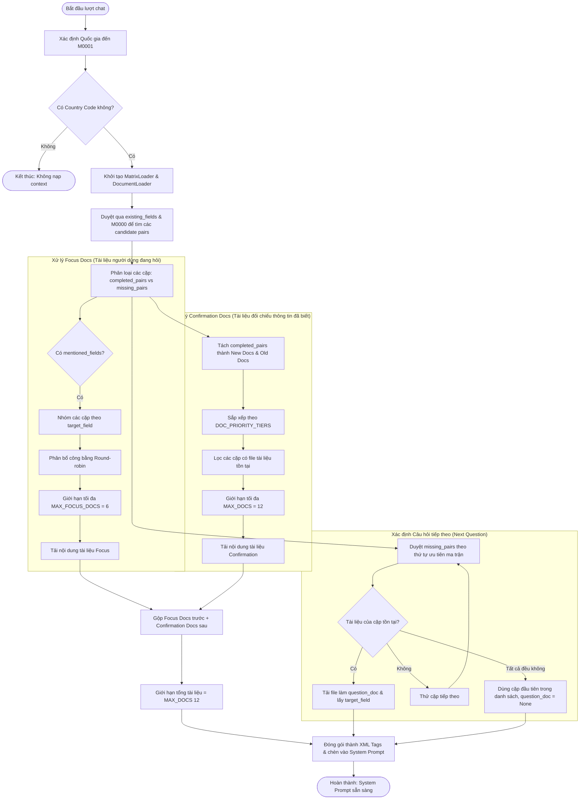

# Phân Tích Chi Tiết Pipeline Retrieve (LISA AI Agent)

Tài liệu này phân tích chi tiết kiến trúc, luồng xử lý và cách hoạt động của **Pipeline Retrieve** trong LISA AI Agent (bỏ qua thành phần trích xuất metadata `tool100`). Pipeline này chịu trách nhiệm tìm kiếm, phân loại và tải các tài liệu nghiệp vụ (quy định visa của từng quốc gia) dưới dạng markdown từ bộ lưu trữ để cung cấp ngữ cảnh chính xác cho LLM ở mỗi lượt hội thoại.

---

## 1. Tổng Quan Kiến Trúc Dữ Liệu
Hệ thống lưu trữ tài liệu nghiệp vụ cục bộ theo cấu trúc phân mục quốc gia tại thư mục `storage/private/market_data/`. Mỗi thư mục quốc gia (ví dụ: `HK` - Hồng Kông, `JP` - Nhật Bản, `CN` - Trung Quốc...) gồm các thành phần:

1. **Ma trận quyết định (`deterministic_layer.csv`)**: 
   - Định nghĩa mối quan hệ và độ ưu tiên giữa các trường thông tin (metadata fields).
   - Các dòng đại diện cho trường nguồn (Source Field), các cột đại diện cho trường đích (Target Field).
   - Giá trị tại giao điểm thể hiện mức độ ưu tiên của cặp trường thông tin đó:
     - `none`: Không liên quan.
     - `confirm`: Cần xác nhận thông tin giữa hai trường này.
     - `c_fail` (hoặc `c fail`): Điều kiện từ chối sớm (Early Reject / Blacklist).
     - `c_pass` (hoặc `c pass`): Điều kiện duyệt nhanh (Fast Pass).
2. **Các tài liệu nghiệp vụ theo cặp trường**:
   - Được tổ chức theo các thư mục con có định dạng `{field_id_1}_{field_id_2}` (ví dụ: `M0001_M0002/`).
   - Tên thư mục và tên file markdown bên trong luôn được sắp xếp theo thứ tự bảng chữ cái của mã trường (ví dụ: `M0001` trước `M0002`, nên đường dẫn là `M0001_M0002/M0001_M0002.md`).
   - Tài liệu này chứa nội dung hướng dẫn chi tiết (guideline) khi cả hai trường thông tin này tương tác với nhau.

---

## 2. Sơ Đồ Luồng Hoạt Động (Activity Flow)

Sơ đồ dưới đây biểu diễn cách Pipeline Retrieve hoạt động từ khi nhận thông tin metadata đến khi tích hợp tài liệu vào prompt cho LLM.



---

## 3. Chi Tiết Các Thành Phần Mã Nguồn

### 3.1. `MatrixLoader` (`app/domains/suggestion/matrix_loader.py`)
Lớp này chịu trách nhiệm đọc ma trận CSV và trích xuất các trường ứng viên liên quan.

* **Cách hoạt động**:
  - Đọc file CSV bằng `pandas.read_csv`. 
  - Sử dụng cấu hình `skiprows=1` để bỏ qua dòng tiêu đề tiếng Việt đầu tiên (dòng 1) và `index_col=1` để lấy mã trường (dòng 2, cột 2) làm hàng chỉ mục (Row Index).
  - Trả về một `DataFrame` có index và columns là mã của các trường metadata (ví dụ: `M0001`, `M0002`, `O5001`...).
* **Hàm `get_candidates(field_id, exclude_fields)`**:
  - Dựa vào mã trường đầu vào `field_id` (ví dụ: `M0001`), tìm dòng tương ứng trong ma trận.
  - Duyệt qua từng cột trong dòng này, nếu giá trị tại ô giao nhau là một trong các từ khóa độ ưu tiên (`confirm`, `c_fail`, `c fail`, `c_pass`, `c pass`), nó sẽ chuyển đổi về định dạng chuẩn (thay dấu cách bằng gạch dưới) và đưa vào danh sách ứng viên dưới dạng tuple: `(target_field_id, priority)`.

### 3.2. `DocumentLoader` (`app/domains/suggestion/document_loader.py`)
Lớp này thực hiện thao tác đọc ghi file vật lý trong ổ đĩa.

* **Cách xây dựng đường dẫn**:
  - Phương thức `_build_document_path(pair_id)` trả về đường dẫn dạng: `{base_path}/{pair_id}/{pair_id}.md`.
* **Cách đọc file**:
  - Phương thức `get_document_content_by_pair(pair_id)` kiểm tra sự tồn tại của file. Nếu có, đọc toàn bộ nội dung dưới dạng văn bản (UTF-8).
  - Có các cơ chế bắt lỗi giải mã (`UnicodeDecodeError`) và phát hiện file trống để ghi log phù hợp.

### 3.3. `SuggestionService` (`app/domains/suggestion/service.py`)
Đây là bộ não điều phối toàn bộ quy trình retrieve tài liệu. Khi phương thức `prepare_suggestion_context` được gọi, nó thực thi tuần tự các bước sau:

#### Bước 1: Phân loại cặp trường (`_classify_pairs`)
- Nhận danh sách toàn bộ các ứng viên thu thập được từ ma trận quyết định dựa trên các trường hiện có (`existing_fields`) và các trường không bao giờ hỏi (`NEVER_ASKED_FIELDS` - hiện tại chỉ chứa mã chủ đề `M0000`).
- Duyệt qua từng ứng viên `(target_field, priority, source_field)`:
  - Tạo `pair_id` bằng cách sắp xếp theo thứ tự bảng chữ cái để loại bỏ trùng lặp giữa hai chiều (ví dụ: `M0001` và `M0002` luôn tạo ra `M0001_M0002`).
  - **Completed Pairs**: Nếu cả hai trường `source_field` và `target_field` đều đã tồn tại trong metadata của khách hàng (hoặc một trong hai là `M0000` và trường còn lại đã có giá trị). Điều này có nghĩa thông tin của cả 2 trường đã xác định, tài liệu này dùng để **đối chiếu và xác nhận thông tin**.
  - **Missing Pairs**: Nếu trường nguồn đã có giá trị nhưng trường đích chưa có giá trị. Điều này có nghĩa thông tin chưa đầy đủ, tài liệu này dùng để **hướng dẫn đặt câu hỏi thu thập tiếp**.

#### Bước 2: Xử lý tài liệu Tiêu điểm (`_prepare_focus_docs`)
- Khi người dùng chủ động hỏi về một số thông tin chưa có giá trị (`mentioned_fields`), hệ sinh thái sẽ ưu tiên tải các tài liệu liên quan đến các trường này.
- **Thuật toán phân bổ công bằng (Round-robin)**:
  - Nếu người dùng hỏi nhiều chủ đề cùng lúc (ví dụ hỏi cả về công việc `O2001` lẫn sổ tiết kiệm `O3001`), để tránh việc một chủ đề chiếm toàn bộ dung lượng prompt, hệ thống sẽ gom các cặp tài liệu theo từng trường mục tiêu.
  - Hệ thống duyệt vòng tròn qua các nhóm này và lấy ra tài liệu có độ ưu tiên cao nhất của mỗi nhóm cho đến khi chạm mốc `MAX_FOCUS_DOCS` (tối đa 6 tài liệu).
  - Các tài liệu tiêu điểm được sắp xếp theo mức độ ưu tiên giảm dần bằng `FOCUS_DOC_PRIORITY_TIERS`.

#### Bước 3: Xử lý tài liệu Xác nhận (`_prepare_confirmation_docs`)
- Nhận danh sách các `completed_pairs` thu được ở Bước 1.
- Phân loại tài liệu thành hai nhóm:
  - **New Docs**: Tài liệu có chứa ít nhất một trường thông tin vừa được cập nhật mới hoặc thay đổi giá trị trong lượt chat hiện tại (`new_field_ids`).
  - **Old Docs**: Tài liệu chứa các thông tin đã được thu thập từ các lượt chat trước và không thay đổi.
- **Sắp xếp theo Attention-aware (`DOC_PRIORITY_TIERS`)**:
  - Tài liệu mới luôn được ưu tiên xếp lên trước tài liệu cũ để LLM tập trung vào thông tin vừa thu nhận.
  - Trong mỗi nhóm, tài liệu được sắp xếp dựa trên sự kết hợp giữa 3 yếu tố:
    1. *Độ ưu tiên ma trận*: `c_fail` (cao nhất) > `c_pass` > `confirm`.
    2. *Loại trường*: Trường bắt buộc (`mandatory` - cả hai trường đều bắt đầu bằng chữ `M`) xếp trước các trường thông tin khác (`other`).
    3. *Độ mới*: `new` xếp trước `old`.
  - Công thức quy đổi mức độ ưu tiên chi tiết từ cao xuống thấp (từ Tier 0 đến Tier 11):
    ```python
    DOC_PRIORITY_TIERS = {
        # === NEW DOCS ===
        "c_fail_mandatory_new": 0,
        "c_fail_other_new": 1,
        "c_pass_mandatory_new": 2,
        "c_pass_other_new": 3,
        "confirm_mandatory_new": 4,
        "confirm_other_new": 5,
        # === OLD DOCS ===
        "c_fail_mandatory_old": 6,
        "c_fail_other_old": 7,
        "c_pass_mandatory_old": 8,
        "c_pass_other_old": 9,
        "confirm_mandatory_old": 10,
        "confirm_other_old": 11,
    }
    ```
  - Sau khi sắp xếp, hệ thống kiểm tra sự tồn tại thực tế của file tài liệu và cắt danh sách lấy tối đa `MAX_DOCS` (12 tài liệu) trước khi thực hiện đọc file nhằm tiết kiệm chi phí I/O.

#### Bước 4: Trộn và gộp tài liệu (`_merge_prompt_docs`)
- Gộp `focus_docs` lên đầu tiên, sau đó mới bổ sung `confirmation_docs` chưa có trong danh sách.
- Việc đặt `focus_docs` lên trước đảm bảo LLM phản hồi trực tiếp các ý hỏi của khách hàng mà không bị phân tâm bởi các tài liệu xác nhận khác.
- Giới hạn lại tổng số tài liệu sau khi trộn không vượt quá `MAX_DOCS` (12 tài liệu).

#### Bước 5: Tìm kiếm tài liệu câu hỏi tiếp theo (`_prepare_question_context`)
- Duyệt qua danh sách `missing_pairs` đã được sắp xếp theo mức độ ưu tiên ma trận (`c_fail` > `c_pass` > `confirm`).
- Tìm cặp đầu tiên có file tài liệu nghiệp vụ tồn tại và tải thành công. 
- Trả về: `target_field` (trường cần thu thập tiếp), `question_doc` (nội dung hướng dẫn đặt câu hỏi cho trường đó), và mức độ ưu tiên của câu hỏi (`SuggestionPriority`).
- Nếu không có cặp nào có tài liệu, hệ thống sử dụng cặp đầu tiên trong danh sách làm mục tiêu đặt câu hỏi tiếp theo nhưng gán `question_doc = None`.

---

## 4. Cách Tích Hợp Tài Liệu Vào System Prompt

Sau khi chạy xong Pipeline Suggestion tại `SuggestionNode`, kết quả `SuggestionContext` thu được được đưa vào module xây dựng Prompt (`app/domains/chat/prompts/builder.py`):

1. **Phần Tài liệu Xác nhận (Confirmation Section)**:
   - Các tài liệu xác nhận được định dạng thành các khối XML rõ ràng để LLM dễ nhận biết cấu trúc:
     ```xml
     <knowledge_for_{Field_Source}_and_{Field_Target}>
     [Tài liệu: {Tên_Trường_1} → {Tên_Trường_2}]
     {Nội dung chi tiết trong file markdown}
     </knowledge_for_{Field_Source}_and_{Field_Target}>
     ```
   - Ví dụ thực tế:
     ```xml
     <knowledge_for_Quốc_gia_đến_and_Mục_đích>
     [Tài liệu: Quốc gia đến → Mục đích]
     Khi nộp hồ sơ xin visa Hồng Kông, người nộp hồ sơ cần xác định rõ mục đích nhập cảnh...
     </knowledge_for_Quốc_gia_đến_and_Mục_đích>
     ```

2. **Phần Tài liệu Câu hỏi Tiếp theo (Question Section)**:
   - Nếu dữ liệu bắt buộc (mandatory fields) của khách hàng chưa đầy đủ, prompt sẽ ưu tiên hướng dẫn hỏi thông tin bắt buộc còn thiếu.
   - Nếu mandatory fields đã đầy đủ, hệ thống sẽ sử dụng thông tin từ `SuggestionContext` để hiển thị:
     - Trường metadata cần hỏi tiếp theo kèm mô tả (`field_description`).
     - Danh sách các giá trị hợp lệ gợi ý (`allowed_values`).
     - Tài liệu hướng dẫn chi tiết cách hỏi đối với trường này (`question_doc`).
     - Một widget lựa chọn nhanh dưới dạng JSON (`user_choice_json`) được kết xuất từ cấu hình trường để giao diện người dùng hiển thị các nút bấm phản hồi nhanh.

---

## 5. Đánh Giá Thiết Kế & Gợi Ý Tối Ưu Hóa

### 5.1. Ưu điểm nổi bật
* **Chiến lược xếp hạng tối ưu (Attention-aware Sorting)**: Tận dụng các đặc tính của LLM (nhạy cảm hơn với thông tin ở đầu và cuối ngữ cảnh) bằng cách đặt tài liệu người dùng đang hỏi và tài liệu thông tin mới lên hàng đầu.
* **Cơ chế Early Reject tinh gọn**: `EarlyRejectNode` quét các cặp `c_fail` đã hoàn thành và chấm dứt luồng xử lý bình thường ngay lập tức nếu phát hiện người dùng rơi vào blacklist mà không cần gọi LLM, giúp tiết kiệm chi phí và tăng tốc phản hồi.
* **Round-robin công bằng**: Giải quyết được trường hợp người dùng hỏi dồn dập nhiều thông tin bằng cách đảm bảo đa dạng hóa ngữ cảnh thay vì bị chiếm dụng bởi duy nhất một chủ đề.

### 5.2. Hạn chế & Giải pháp cải tiến đề xuất
1. **Instance-level Caching trong `MatrixLoader`**:
   - *Hiện trạng*: Mỗi request khởi tạo một instance `SuggestionService` mới dẫn đến việc đọc và phân tích file CSV `deterministic_layer.csv` bị lặp lại liên tục, gây mất từ 100ms - 200ms cho mỗi request.
   - *Giải pháp*: Cần áp dụng Singleton Pattern hoặc một bộ cache toàn cục ở cấp độ Module/Class dạng `dict[country_code, pd.DataFrame]` để chỉ tải ma trận một lần và tái sử dụng cho các luồng xử lý sau.
2. **Xử lý bất đồng bộ I/O**:
   - *Hiện trạng*: `DocumentLoader` sử dụng phương thức đọc file đồng bộ (`Path.read_text`) và kiểm tra file (`Path.exists`) trực tiếp trên luồng xử lý chính (main event loop) của FastAPI. Điều này có thể chặn (block) event loop khi có lượng truy cập đồng thời lớn.
   - *Giải pháp*: Nên chuyển đổi các thao tác đọc và kiểm tra file sang bất đồng bộ sử dụng thư viện `aiofiles` hoặc thực thi các tác vụ I/O đồng bộ này trong một ThreadPoolExecutor qua `loop.run_in_executor`.
3. **Tính chính xác của tên thư mục (Order Insensitivity)**:
   - *Hiện trạng*: Mã nguồn chứa bình luận TODO về việc lỗi có thể xảy ra nếu thư mục tài liệu lưu trữ sai thứ tự bảng chữ cái (ví dụ: `M0002_M0001` thay vì `M0001_M0002`).
   - *Giải pháp*: Trong hàm `_build_document_path`, thay vì giả định cứng thứ tự bảng chữ cái, có thể kiểm tra sự tồn tại của cả 2 đường dẫn (hoặc tạo cơ chế chuẩn hóa tên thư mục tự động trước khi chạy).
