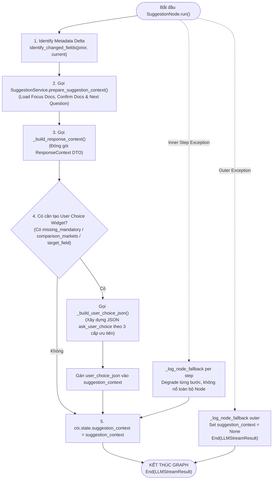

# Phân Tích Chi Tiết SuggestionNode (LISA AI Agent)

Tài liệu này phân tích chuyên sâu về kiến trúc, luồng tổng hợp ngữ cảnh (Context Assembly Pipeline), cơ chế tạo Widget UI Lựa Chọn (`ask_user_choice`) và quy trình đóng gói dữ liệu kết thúc Graph của **`SuggestionNode`** trong hệ thống LISA AI Agent. Node này là "cửa ngõ cuối cùng" trước khi chuyển giao payload cho LLM Response Streaming Engine.

---

## 1. Tham Chiếu Mã Nguồn Trực Tiếp (Direct File References)

* **File Node Thực Thi**: [`app/domains/chat/graph/nodes/suggestion.py`](file:///Users/admin/Desktop/Hoang_Huy/lisa-ai-agent/app/domains/chat/graph/nodes/suggestion.py)
* **File Suggestion Service**: [`app/domains/suggestion/service.py`](file:///Users/admin/Desktop/Hoang_Huy/lisa-ai-agent/app/domains/suggestion/service.py)
* **File Metadata Service**: [`app/domains/metadata/service.py`](file:///Users/admin/Desktop/Hoang_Huy/lisa-ai-agent/app/domains/metadata/service.py)
* **File Định Nghĩa Hằng Số Metadata**: [`app/domains/metadata/constants.py`](file:///Users/admin/Desktop/Hoang_Huy/lisa-ai-agent/app/domains/metadata/constants.py) (`EU_COUNTRIES`, `TRAVEL_HISTORY_NEARBY_COUNTRIES_DEFAULT`, `FIXED_METADATA_VALUES`, `C_FAIL_NONE_VALUE`)
* **File Schema Kết Quả Stream**: [`app/domains/chat/graph/results.py`](file:///Users/admin/Desktop/Hoang_Huy/lisa-ai-agent/app/domains/chat/graph/results.py) (`LLMStreamResult`)
* **File Response Context Schema**: [`app/domains/chat/schemas.py`](file:///Users/admin/Desktop/Hoang_Huy/lisa-ai-agent/app/domains/chat/schemas.py) (`ResponseContext`)

---

## 2. Tổng Quan Kiến Trúc, Vai Trò Node & Giải Thích Thuật Ngữ

`SuggestionNode` kế thừa từ `BaseNode[ChatState, ChatDeps, ChatResult]` của `pydantic_graph`.
Mục tiêu cốt lõi của node bao gồm 5 chức năng chính kèm giải thích thuật ngữ chuyên sâu:

### 2.1. Xác Định Biến Đổi Metadata Delta (`identify_changed_fields`)
Node so sánh metadata cũ do client truyền lên trong request (`visa_applicant`) với metadata mới vừa tích lũy trong `full_metadata` để xác định danh sách các trường mới được cập nhật trong lượt này (`new_field_ids`).

> 💡 **Giải thích thuật ngữ: Metadata Delta là gì?**
> * Là tập hợp các mã trường metadata mới vừa được trích xuất thành công hoặc bị thay đổi giá trị ở lượt chat hiện tại.
> * Việc phát hiện delta giúp `SuggestionService` nạp các tài liệu đối chiếu (Confirmation Docs) cho những thông tin mới cập nhật thay vì nạp lại toàn bộ tài liệu cũ.

### 2.2. Chuẩn Bị Ngữ Cảnh Gợi Ý (`prepare_suggestion_context`)
Gọi `SuggestionService` để truy vấn ma trận quyết định (`deterministic_layer.csv`), nạp Focus Docs (tài liệu người dùng đang hỏi), Confirmation Docs (tài liệu đối chiếu) và cặp câu hỏi tiếp theo.

### 2.3. Đóng Gói `ResponseContext` (`_build_response_context`)
Tổng hợp toàn bộ thông tin trạng thái trên `ChatState` (như `is_visa_topic`, `topic_label`, `mandatory_complete`, `missing_mandatory_display`, `user_intent`, `comparison_markets`, `comparison_docs`) vào đối tượng DTO `ResponseContext` để đưa vào prompt cho LLM.

### 2.4. Xây Dựng Widget UI Lựa Chọn (`_build_user_choice_json`)
Xây dựng chuỗi JSON `ask_user_choice` để nhúng vào prompt. Widget này giúp Frontend hiển thị các nút chọn bấm nhanh cho người dùng.

> 💡 **Giải thích thuật ngữ: Thứ tự ưu tiên xây dựng Widget UI (`_build_user_choice_json`)**:
> 1. **Ưu Tiên 1 (Intent `COMPARISON`)**: Nếu đang trong luồng so sánh, tự động tạo widget chọn quốc gia dựa trên `state.comparison_markets`.
> 2. **Ưu Tiên 2 (Trường Mandatory Thiếu)**: Nếu có trường bắt buộc chưa điền, tạo widget chọn giá trị cho trường thiếu đầu tiên (`missing[0]`). Áp dụng quy tắc đặc biệt: `M0001="Europe"` ➔ Hiện 27 quốc gia EU (`EU_COUNTRIES`), `O5001` (Lịch sử du lịch) ➔ Hiện các quốc gia lân cận (`TRAVEL_HISTORY_NEARBY_COUNTRIES_DEFAULT`).
> 3. **Ưu Tiên 3 (Target Field từ Suggestion Context)**: Nếu đã đủ trường bắt buộc, tạo widget cho trường đích tiếp theo cần hỏi từ ma trận.
> * **Đặc biệt với trường C-Fail (Blacklist)**: Tự động bổ sung option `"Không thuộc trường hợp nào"` với `id = C_FAIL_NONE_VALUE` ("Không có") để khách hàng có nút bấm xác nhận an toàn.

### 2.5. Kết Thúc Graph & Trả Về `End(LLMStreamResult)`
Node đóng gói toàn bộ dữ liệu vào `LLMStreamResult` và trả về `End(LLMStreamResult(...))`, chính thức kết thúc tiến trình thực thi của Graph và trao dữ liệu cho LLM Streaming Engine.

---

## 3. Dynamic State Ownership & Graph Edges

### 3.1. Trường State Độc Quyền
* **`suggestion_context`**: Đối tượng `SuggestionContext | None` lưu trữ tài liệu gợi ý và chuỗi widget `user_choice_json`.

### 3.2. Cạnh Kết Thúc Graph (Graph End Edge)
* **`Annotated[End[ChatResult], Edge(label="LLM stream")]`**: Node đánh dấu điểm kết thúc của Graph execution.

---

## 4. Sơ Đồ Luồng Hoạt Động Chi Tiết (Activity Flowchart)

---

## 5. Bảng Ma Trận Kháng Lỗi Đa Tầng (Multi-Stage Fallback Matrix)

Node áp dụng kiến trúc **Non-Critical Multi-Stage Fallback**: Mỗi bước nhỏ bên trong đều được bọc trong khối `try...except` riêng lẻ. Lỗi ở bước nào chỉ degrade bước đó chứ không làm hỏng toàn bộ Node!

| Bước Xử Lý Nội Bộ | Kịch Bản Lỗi | Hành Vi Phục Hồi (Degradation Behavior) |
| :--- | :--- | :--- |
| `identify_changed_fields` | Lỗi so sánh metadata cũ/mới | Log fallback `suggestion_identify_changed_fields`, tiếp tục với `new_field_ids = set()`. |
| `prepare_suggestion_context` | Lỗi đọc ma trận/tài liệu | Log fallback `suggestion_prepare`, tiếp tục với `suggestion_context = None`. |
| `_build_response_context` | Lỗi đọc State/Service | Log fallback `suggestion_build_response_context`, gán `response_context = ResponseContext()`. |
| `_build_user_choice_json` | Lỗi serialize JSON widget | Log fallback `suggestion_build_user_choice`, bỏ qua widget (`user_choice_json = None`). |
| Ngoại lệ toàn bộ Node (Outer Catch) | Lỗi nghiêm trọng không lường trước | Catch lỗi outer, gán `suggestion_context = None`, vẫn trả về `End(LLMStreamResult)` chứa empty `ResponseContext()`. |

---

## 6. Tổng Kết Ưu Điểm Thiết Kế (Key Takeaways)

1. **Kiến Trúc Kháng Lỗi Đa Tầng Cực Kỳ Bền Vững**: Nhờ phân rã `try...except` theo từng bước nhỏ, `SuggestionNode` không bao giờ sập, luôn trả về `LLMStreamResult` để LLM phản hồi cho khách hàng.
2. **Tự Động Hóa Widget UI Lựa Chọn**: Cơ chế phân giải `_resolve_allowed_values` thông minh giúp hiển thị danh sách nút bấm tối ưu (ví dụ 27 nước EU khi chọn Châu Âu, các nước lân cận khi chọn lịch sử du lịch).
3. **Cửa Ngõ Đóng Gói Dữ Liệu Hoàn Chỉnh**: Nơi quy tụ tất cả các bối cảnh (`full_metadata`, `response_context`, `information_needs`, `suggestion_context`) truyền sang cho LLM Response Streaming.
